# GDD - Game Design Document - Módulo 1 - Inteli

## CyberTech

#### André David Katz, Celso Rodrigues Rocha Júnior, Daniel Meiches, Kaian Santos Moura, Luiz Gustavo Borges Oliveira, Miguel Ferreira de Siqueira Almeida e Wendel Hebert Feitosa.

## Sumário

[1. Introdução](#c1)

[2. Visão Geral do Jogo](#c2)

[3. Game Design](#c3)

[4. Desenvolvimento do jogo](#c4)

[5. Casos de Teste](#c5)

[6. Conclusões e trabalhos futuros](#c6)

[7. Referências](#c7)

[Anexos](#c8)

 

# 1. Introdução (sprints 1 a 4)

## 1.1. Plano Estratégico do Projeto

### 1.1.1. Contexto da indústria (sprint 2)

O mercado de educação digital está se tornando cada vez mais competitivo, com gigantes como Microsoft e Apple oferecendo soluções educacionais semelhantes por via do Office e do Apple Education, respectivamente. Startups de EdTech também trazem inovações constantes no mercado. De acordo com um Mapeamento de startups feito pela Abstartups, em 2022 foram identificadas 813 startups de EdTech ativas no Brasil, que é 44% mais startups comparado com 2021. As escolas e universidades estão em busca de ferramentas mais integradas e fáceis de usar, especialmente com o crescimento do ensino híbrido e remoto. As novas tecnologias, como inteligência artificial e aprendizagem adaptativa, estão mudando rapidamente o cenário e oferecendo grandes oportunidades para empresas como o Google for Education se destacarem. No entanto, essa inovação também exige atenção às regulamentações de privacidade e segurança, que estão ficando cada vez mais rigorosas em diversos países. Para continuar relevante, o Google for Education precisa se adaptar rapidamente às necessidades emergentes das instituições educacionais de todo o mundo, pois suas atividades se estendem por diversos países e necessitam estar atento às mudanças legais, sem perder de vista a crescente concorrência no setor.

### 1.1.1.1. Modelo de 5 Forças de Porter (sprint 2)

#### - Análise da Ameaça de Novos Entrantes:
A ameaça de novos entrantes no mercado de tecnologias educacionais é significativa, especialmente com o crescimento de startups e empresas que buscam atender à crescente demanda por soluções digitais no setor educacional, porém é dificultada por barreiras como altos custos iniciais, exigências regulatórias (como a LGPD) e a fidelização dos usuários a plataformas consolidadas. Entretanto, o Google for Education mantém uma posição consolidada, oferecendo um ecossistema abrangente de ferramentas integradas que facilitam a adoção por instituições de ensino. Além disso, a empresa investe continuamente em tecnologias emergentes, como inteligência artificial, realidade virtual e aumentada, fortalecendo sua oferta e criando barreiras para novos concorrentes. A reputação estabelecida e a capacidade de inovação do Google for Education tornam desafiadora a entrada de novos players que desejam competir em igualdade de condições.

#### - Análise da Ameaça de Produtos ou Serviços Substitutos:
A ameaça de produtos ou serviços substitutos para o Google for Education é moderada, dado o número crescente de alternativas no mercado de tecnologias educacionais. Plataformas como Canvas, Edmodo e Moodle oferecem sistemas de gestão de aprendizagem com funcionalidades semelhantes, permitindo que instituições de ensino gerenciem cursos, distribuam conteúdo e avaliem o desempenho dos alunos. Além disso, ferramentas como o Microsoft Teams estão sendo cada vez mais adotadas em ambientes educacionais, proporcionando recursos integrados de comunicação e colaboração. No entanto, o Google for Education mantém uma posição competitiva sólida devido à sua integração perfeita com outros serviços do Google, facilidade de uso e uma base de usuários já estabelecida, o que dificulta a substituição completa por alternativas.

#### - Análise do Poder de Barganha dos Fornecedores: 
O poder de barganha dos fornecedores em relação ao Google for Education é baixo, pois a empresa possui uma infraestrutura tecnológica própria, incluindo uma vasta rede de data centers, reduzindo sua dependência externa. Além disso, colabora com múltiplos fabricantes de hardware, como os de Chromebooks, e mantém parcerias estratégicas globais para distribuir e integrar suas soluções educacionais. Essa diversificação enfraquece a influência de fornecedores individuais, permitindo ao Google maior controle sobre custos e inovações. A empresa também incentiva a colaboração com parceiros para vender produtos, oferecer serviços e criar soluções dentro de seu ecossistema, ampliando suas ofertas educacionais e consolidando sua posição no mercado. 

#### - Análise do Poder de Barganha dos Clientes:
O poder de barganha dos clientes em relação ao Google for Education é moderado. Embora a empresa ofereça ferramentas gratuitas, como o Google Workspace for Education Fundamentals, que incluem aplicativos como Documentos, Planilhas e Apresentações, as instituições de ensino podem optar por soluções alternativas, como Microsoft 365 Education ou plataformas de código aberto, caso suas necessidades não sejam atendidas. Para aumentar o valor percebido e incentivar a adoção de suas soluções, o Google for Education disponibiliza complementos pagos, como o Gemini Education e o Gemini Education Premium, que oferecem recursos avançados de inteligência artificial generativa. Além disso, a empresa mantém uma rede de mais de 4.000 especialistas para auxiliar escolas na implementação eficaz de suas tecnologias. Essas iniciativas buscam fortalecer a lealdade dos clientes e reduzir seu poder de barganha.

#### - Análise da Rivalidade entre os Concorrentes Existentes:
A rivalidade entre os concorrentes no mercado de tecnologias educacionais é intensa, com o Google for Education enfrentando competidores significativos. Plataformas como Canvas LMS, que detém 7,75% do mercado, e RenWeb, com 7,05%, oferecem sistemas de gestão de aprendizagem robustos e amplamente adotados. Além disso, alternativas como Kami, Flipgrid e Lockdown Browser proporcionam funcionalidades específicas que competem diretamente com as ferramentas do Google for Education. A presença de soluções de código aberto, como o Moodle, e ofertas de grandes corporações, como o Microsoft Teams, também intensificam a competição, oferecendo opções diversificadas para instituições de ensino. Para manter sua posição de destaque, o Google for Education investe continuamente na integração de suas ferramentas, na expansão de recursos e no fortalecimento de parcerias estratégicas, buscando atender às necessidades dinâmicas do setor educacional. 

### 1.1.2. Análise SWOT (sprint 2)

Entre as forças do Google for Education, destacam-se a credibilidade da marca Google, a integração de suas ferramentas com outros serviços do Google como Drive e Docs e a facilidade de uso que torna suas soluções populares em escolas e universidades. No entanto, suas fraquezas incluem a dependência de uma conexão de internet estável, o que pode ser um desafio em áreas com infraestrutura limitada, além de dificuldades na personalização de ferramentas para diferentes necessidades educacionais. As oportunidades são amplas, com o crescimento do mercado de educação digital e o potencial de integrar tecnologias emergentes, como inteligência artificial, para aprimorar a experiência de aprendizagem. Por outro lado, as ameaças incluem a forte concorrência de outras empresas como Microsoft e Apple, que também oferecem soluções educacionais populares, e as preocupações crescentes com a privacidade e segurança dos dados dos alunos, especialmente em face de regulamentações cada vez mais rigorosas.

### 1.1.3. Missão / Visão / Valores (sprint 2)

A missão deste projeto é educar alunos e professores de forma divertida e envolvente sobre a importância da Lei Geral de Proteção de Dados LGPD  enquanto eles jogam um RPG sobre um aluno tentando impedir um hacker de roubar dados de sua escola. Durante a jornada, os jogadores terão que responder perguntas sobre a LGPD para libertar as salas trancadas e enfrentar desafios, tornando a educação sobre privacidade algo prático e empolgante. A visão é usar a narrativa de uma invasão hacker para mostrar de forma clara e dinâmica como a proteção de dados afeta nosso cotidiano, incentivando os jogadores a se tornarem mais conscientes e responsáveis no uso da tecnologia. Os valores do jogo são a promoção da privacidade, a segurança da informação e a ética digital, com o objetivo de criar uma experiência que vai além do entretenimento, tornando os jogadores mais preparados para lidar com os desafios da era digital.

### 1.1.4. Proposta de Valor (sprint 4)

*Posicione aqui o canvas de proposta de valor. Descreva os aspectos essenciais para a criação de valor da ideia do produto com o objetivo de ajudar a entender melhor a realidade do cliente e entregar uma solução que está alinhado com o que ele espera.*

### 1.1.5. Descrição da Solução Desenvolvida (sprint 4)

*Descreva brevemente a solução desenvolvida para o parceiro de negócios. Descreva os aspectos essenciais para a criação de valor da ideia do produto com o objetivo de ajudar a entender melhor a realidade do cliente e entregar uma solução que está alinhado com o que ele espera. Observe a seção 2 e verifique que ali é possível trazer mais detalhes, portanto seja objetivo aqui. Atualize esta descrição até a entrega final, conforme desenvolvimento.*

### 1.1.6. Matriz de Riscos (sprint 4)

*Registre na matriz os riscos identificados no projeto, visando avaliar situações que possam representar ameaças e oportunidades, bem como os impactos relevantes sobre o projeto. Apresente os riscos, ressaltando, para cada um, impactos e probabilidades com plano de ação e respostas.*

### 1.1.7. Objetivos, Metas e Indicadores (sprint 4)

*Definição de metas SMART (específicas, mensuráveis, alcançáveis, relevantes e temporais) para seu projeto, com indicadores claros para mensuração*

## 1.2. Requisitos do Projeto (sprints 1 e 2)

Os requisitos do projeto descrevem as funcionalidades essenciais para o desenvolvimento do jogo, garantindo seu correto funcionamento. Eles incluem mecânicas básicas, como movimentação e interação, além de elementos específicos da jogabilidade, como o sistema de combate baseado em perguntas sobre a LGPD. Esses requisitos são fundamentais para estruturar a experiência do jogador e assegurar a coerência do jogo dentro do seu tema e objetivo educacional.

Abaixo está todos os requisitos que trabalhamos na sprint 1 e 2.

| \#  | Requisito | Descrição  |
| --- | --- | --- |
| 1 | Controle do personagem | O jogador pode mover o personagem utilizando as teclas WASD para movimentação. |
| 2 | Interação com NPCs | Durante a exploração, o jogador pode conversar com personagens do jogo para obter informações e avançar na narrativa. |
| 3 | Combate baseado em perguntas e respostas sobre LGPD | Durante os confrontos, o jogador precisará responder corretamente a perguntas sobre a Lei Geral de Proteção de Dados (LGPD) para vencer os desafios. |
| 4 | Divisão do jogo em fases | O jogo será dividido em três fases representando os andares de uma escola, totalizando três andares com desafios progressivos. |
| 5 | História baseada na proteção de dados dentro de uma escola | O jogador assume o papel de um estudante que deve proteger os dados da escola contra ameaças cibernéticas, aprendendo sobre os conceitos da LGPD. |
| 6 | Progressão baseada na complexidade das perguntas e desafios | À medida que o jogador avança, as perguntas abordam conceitos mais aprofundados da LGPD. |
| 7 | Aprimoramento de personagem | Implementação de melhorias na jogabilidade e características do personagem. |
| 8 | Criação de personagem feminino | Adição de uma opção de personagem jogável do gênero feminino. |
| 9 | Tileset | Desenvolvimento de um conjunto de tiles para compor os cenários do jogo. |
| 10 | Mapa da fase 01 | Criação do mapa completo da primeira fase do jogo. |
| 11 | Contextualização da indústria do mercado | Introdução ao contexto mercadológico da LGPD no jogo. |
| 12 | Análise da ameaça de novos entrantes | Estudo sobre como novos concorrentes podem afetar a proteção de dados. |
| 13 | Análise da ameaça de produtos ou serviços substitutos | Investigação sobre soluções alternativas que impactam a LGPD. |
| 14 | Análise do poder de barganha dos fornecedores | Avaliação do impacto dos fornecedores na segurança de dados. |
| 15 | Análise do poder de barganha dos clientes | Estudo do impacto dos clientes na gestão de dados. |
| 16 | Análise da rivalidade entre concorrentes existentes | Análise da competição no mercado de segurança de dados. |
| 17 | Análise SWOT | Identificação de forças, fraquezas, oportunidades e ameaças. |
| 18 | Missão, visão e valores | Definição da identidade e propósito do jogo. |
| 19 | Referências e fontes de pesquisa | Inclusão de fontes usadas no desenvolvimento do jogo. |
| 20 | Nova cena | Implementação de uma nova cena no jogo. |
| 21 | NPC 'faxineiro' | Criação do NPC faxineiro e sua interação com o jogador. |
| 22 | NPC 'professor' | Criação do NPC professor e sua interação com o jogador. |
| 23 | Implementação de mecânicas | Desenvolvimento de novas mecânicas de jogabilidade. |
| 24 | Diálogos | Criação de interações de diálogo para NPCs. |
| 25 | Novo mapa/cena | Desenvolvimento de um novo mapa para exploração. |
| 26 | Tela de fases | Criação de uma tela para seleção de fases. |
| 27 | Controle de movimento do personagem | Implementação de um sistema responsivo de movimentação para o personagem. |

## 1.3. Público-alvo do Projeto (sprint 2)

De acordo com o nosso parceiro, nosso público abrange alunos, com idades entre 9 e 17 anos, e professores de escolas públicas. Esses alunos estão em diferentes etapas do ensino fundamental e médio, podendo ter distintos níveis de familiaridade com a temática abordada pelo projeto. Já os professores atuam como facilitadores no processo de aprendizado, auxiliando na implementação das atividades e no engajamento dos estudantes. O projeto busca atender às necessidades desse público, oferecendo materiais e metodologias adequadas à sua realidade educacional.

# 2. Visão Geral do Jogo (sprint 2)

## 2.1. Objetivos do Jogo (sprint 2)

O jogo está distribuído em 3 fases. O objetivo final é levar o protagonista até o Data Center da escola, localizado no quinto andar, para impedir que um grupo de hackers faça o upload dos dados de todos. Para avançar, cada fase contém 4 keycards espalhados pelo mapa, protegidos por robôs inimigos. O jogador precisa coletar todos os keycards para desbloquear a última sala da fase, onde encontrará a chave que permite o acesso à próxima fase. Durante essa jornada, será necessário enfrentar batalhas contra inimigos e superar diversos obstáculos enquanto explora a escola.

## 2.2. Características do Jogo (sprint 2)

### 2.2.1. Gênero do Jogo (sprint 2)

O jogo Data Quest se enquadra no gênero RPG (Role-Playing Game), no qual os jogadores assumem o papel de um protagonista e avançam na história ao enfrentar desafios e interagir com o ambiente. O sistema de combate adotado é o turn-based combat (combate baseado em turnos), onde as batalhas ocorrem de forma estratégica, permitindo que o jogador escolha suas ações dentro de cada turno, considerando habilidades, recursos e a melhor abordagem para derrotar os inimigos.

### 2.2.2. Plataforma do Jogo (sprint 2)

O jogo Data Quest será desenvolvido para garantir compatibilidade tanto com desktop quanto com dispositivos móveis, permitindo que os jogadores possam acessá-lo de forma prática e flexível. Para assegurar uma experiência fluida e acessível, o jogo será projetado para rodar diretamente em navegadores da web, sem necessidade de instalação adicional. Os navegadores compatíveis incluem Google Chrome, Opera, Firefox, Safari e Microsoft Edge, garantindo um amplo suporte para diferentes sistemas operacionais e preferências dos usuários.

### 2.2.3. Número de jogadores (sprint 2)

O jogo Data Quest foi projetado para ser uma experiência single-player, oferecendo suporte exclusivo para um único jogador. Todo o desenvolvimento do jogo, incluindo mecânicas, progressão e desafios, foi pensado para proporcionar uma jornada individual imersiva, permitindo que o jogador explore a narrativa, enfrente inimigos e supere obstáculos sem a necessidade de interação com outros jogadores em tempo real.

### 2.2.4. Títulos semelhantes e inspirações (sprint 2)

O desenvolvimento de Data Quest foi inspirado em títulos específicos que serviram como referência tanto para a mecânica quanto para a estética do projeto. As principais influências incluem:

- Pokémon: O sistema de combate por turnos de Data Quest foi inspirado na série de jogos Pokémon, adotando uma abordagem estratégica em que o jogador pode escolher suas ações dentro de cada turno, tornando as batalhas mais táticas e dinâmicas.
- Undertale: A estética visual do jogo, incluindo o design gráfico e as animações das sprites do protagonista, foi influenciada por Undertale. Elementos como pixel art e expressões dinâmicas foram utilizados para trazer personalidade e carisma ao personagem principal, criando uma experiência visual única e envolvente.

### 2.2.5. Tempo estimado de jogo (sprint 5)

*a ser definido*

# 3. Game Design (sprints 2 e 3)

## 3.1. Enredo do Jogo (sprints 2 e 3)

Em um dia comum de aula na escola Bitshine, um hacker com um plano bem elaborado invade a instituição e toma controle dos sistemas internos, trancando as portas de entrada e as salas de aula com alunos dentro. Superando esses obstáculos, ele avança até o quinto e último andar, onde se encontra o Data Center que abriga os servidores com informações sensíveis sobre alunos, professores e a própria escola. O hacker assume o controle dos professores robôs, programados para ensinar os alunos.

Nosso protagonista, estudante da Bitshine, perde a hora e é acordado apressadamente para se dirigir à escola. Chegando lá, não encontra opções de entrada, mas percebe uma janela que está aberta que leva até a sala do faxineiro da escola. Dentro da sala, o protagonista e o faxineiro tem uma conversa que contextualiza o conflito da Bitshine e ensina os básicos da LGPD para o jogador.

Desse ponto, o jogador, controlando o protagonista, vai progredir por cada andar coletando key-cards protegidos pelos professores robôs, controlados pelo hacker, que lhe dá acesso aos diferentes andares da instituição. Ao longo do enredo, o jogador vai encontrar alunos e professores diferentes que o ajudarão a enfrentar os inimigos e que ajudarão a passar conhecimentos das leis LGPD, necessárias para a solução do problema. O objetivo final do protagonista é impedir o sucesso dos planos do hacker e libertar os alunos e professores das salas trancadas, enquanto o jogador aprende sobre a LGPD e a importância da proteção de dados pessoais.

## 3.2. Personagens (sprints 2 e 3)

### 3.2.1. Controláveis

Os jogadores poderão escolher entre seis personagens disponíveis, que representará aluno desajeitado que enfrenta dificuldades com horários e costuma não prestar atenção nas aulas. No entanto, ao longo do jogo, essa falta de atenção se transforma em uma vantagem, pois os personagens se encontram em uma situação onde esses conhecimentos aparentemente negligenciados se tornam suas armas mais poderosas.

Conceitos iniciais da face do personagem:
 

Desenhos de maior qualidade feitos do personagem:
 
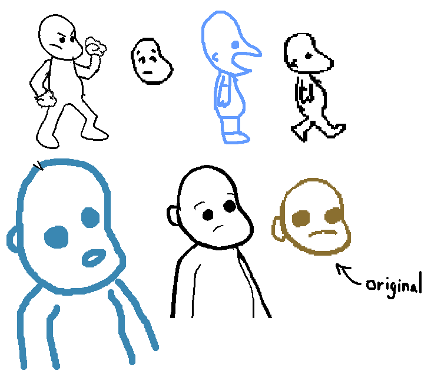

Spritesheet desenvolvida para a Sprint 1. Personagem não tinha cores definidas:
 

### 3.2.2. Non-Playable Characters (NPC)

O Hacker Anônimo: Um criminoso cibernético que arquitetou o ataque na escola Bitshine. Seu principal objetivo é obter lucros substanciais por meio da venda de dados roubados, comprometendo a privacidade e a segurança das vítimas no processo.
 
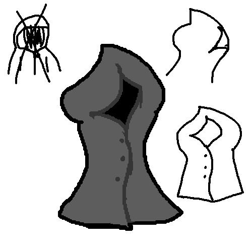

Faxineiro: Primeiro personagem que o protagonista vai interagir no jogo. Dará informações sobre o conflito e ensinará o protagonista sobre conceitos básicos das leis LGPD.
 
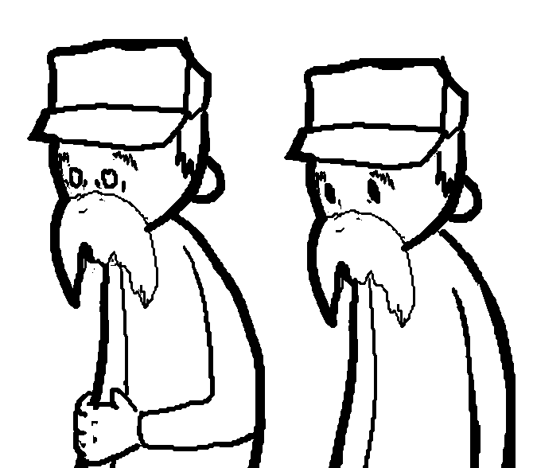

Professora Rôbo: Segundo NPC da primeira fase do jogo. Ela será outra fonte de informações sobre conceitos básicos das leis LGPD.
 

(Terão outros personagens coadjuvantes que são aunos e professores da escola, mas esses não foram definidos ainda)

### 3.2.3. Diversidade e Representatividade dos Personagens

Alinhamento com o público-alvo: Quando o cenário e o enredo do jogo foram concebidos, pensamos em um mundo ficcional que tem uma sociedade tecnologicamente mais avançada e que pode englobar qualquer cultura. O ambiente escolar da escola Bitshine tem uma arquitetura futurista que aborda a Lei Geral de Proteção de Dados (LGPD), que é uma matéria essencial para estudantes que crescem nesse mundo mais digital. Assim, o mundo do jogo é um pouco desconectado da realidade do Brasil, mas todos os personagens enfrentam desafios comuns, como atrasos e desatenção nas aulas, o que facilita a identificação do público jovem com eles.

Diversidade dentro da realidade do Brasil e impacto esperado: Os estudantes da escola Bitshine são um reflexo da diversidade presente na realidade do Brasil, com personagens que representam diferentes etnias e gêneros. O jogo, em seu estado atual, oferece aos jogadores a possibilidade de escolher entre quatro personagens distintos e nomeá-lo da maneira que quiserem, permitindo que se identifiquem com aquele que mais se aproxima de sua própria realidade. O impacto esperado é reforçar a importância da inclusão tanto na educação quanto no setor da tecnologia.

## 3.3. Mundo do jogo (sprints 2 e 3)

### 3.3.1. Locações Principais e/ou Mapas (sprints 2 e 3)

O cenário do jogo se passa na escola Bitshine, que foi invadida e hackeada por um criminoso digital. A narrativa se desenrola ao longo de 3 andares diferentes da escola, cada um representando uma fase única. Conforme os jogadores avançam, eles exploram diferentes ambientes como salas de aula trancadas, corredores bloqueados por segurança digital e outras áreas dentro do prédio.

 
Fotos da escola Bitshine por fora:

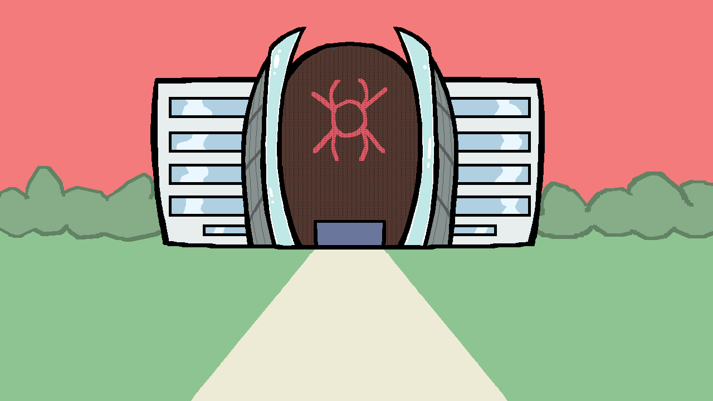

 
Mapa da primeira fase do jogo, situado no primeiro andar da escola:

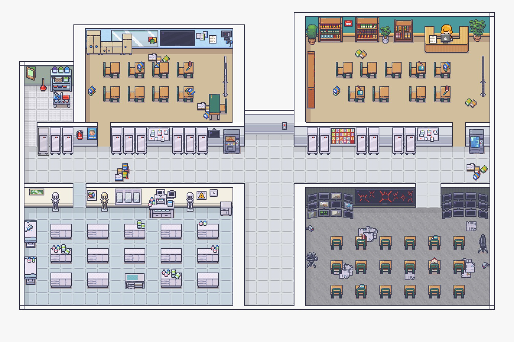

 
Mapa da segunda fase do jogo, um labirinto situado no segundo andar, onde fica a biblioteca da escola:

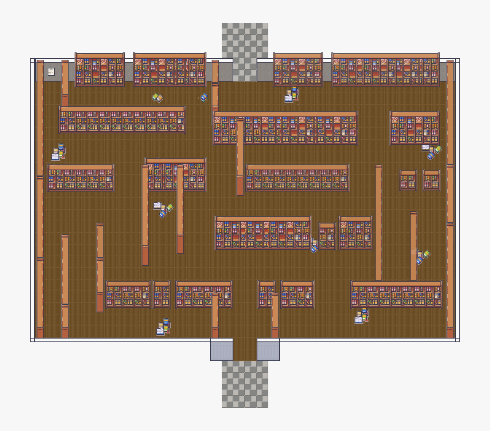

### 3.3.2. Navegação pelo mundo (sprints 2 e 3)

- As 3 fases do jogo vão se passar nos 3 andares diferentes da escola.
- O protagonista explorará cada andar, entrando em salas diferentes tentando encontrar objetos colecionáveis que ajudarão na progressão de cada fase.
- Cada andar terá um key-card e a coleção desses cards é essencial para a progressão no jogo.
- Uma fase se encerra quando o protagonista encontrar a chave contida no andar atual e voltar para o elevador.
- Assim, o acesso para o próximo andar é liberado e a próxima fase é desbloqueada.

### 3.3.3. Condições climáticas e temporais (sprints 2 e 3)

Embora a história do jogo se desenrole ao longo de um único dia escolar, com eventos acontecendo durante as aulas e interações entre os personagens, não haverá limite de tempo para a conclusão das fases. O objetivo é permitir que o jogador explore cada área da escola, resolva puzzles e interaja com os personagens sem pressões externas relacionadas ao tempo. Isso visa garantir uma experiência mais estratégica e imersiva, focada na resolução de problemas e tomada de decisões.

Além disso, o jogo não incluirá variações climáticas, já que a narrativa ocorre inteiramente dentro da escola Bitshine, que está isolada do ambiente externo devido à invasão hacker. Consequentemente, o clima externo e os ciclos temporais, como mudanças de dia para noite, não serão aplicados ou influenciarão o andamento da história ou das fases. A principal ênfase estará na progressão do enredo, nos desafios internos da escola e na interação com o ambiente hackeado.

### 3.3.4. Concept Art (sprint 2)
 

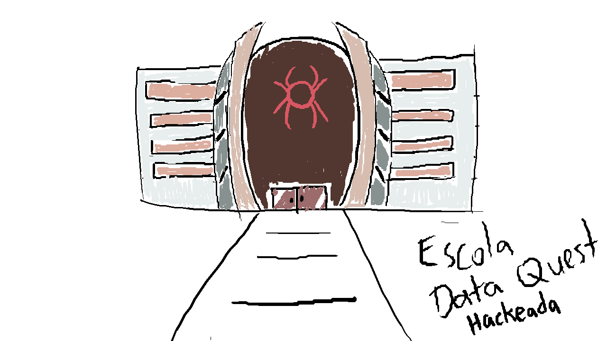

Figuras 1 e 2: Conceitos iniciais da aparência externa da escola Bitshine. Figura 1 representa a escola em seu estado de normalidade e a Figura 2 representa a escola hackeada.

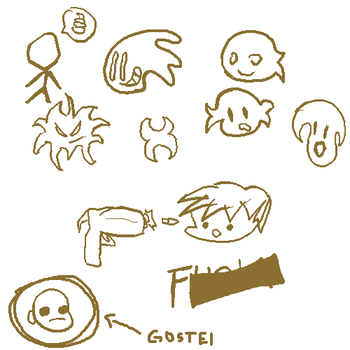

Figura 3: Conceitos iniciais do protagonista, que o jogador poderá nomear.

Figura 4: Conceito inicial do estilo visual do diálogo do jogo.

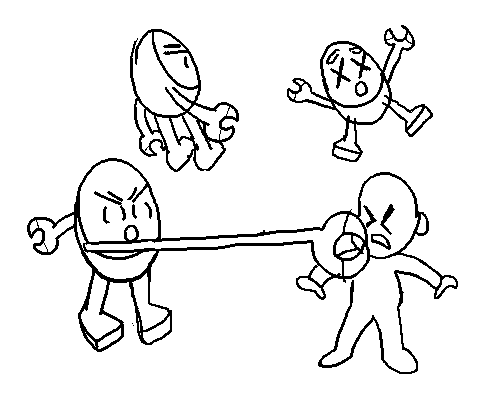

Figura 5: Conceitos de ataques feitos pelos inimigos robôs.

Figura 6: Ilustração do inimigo robô com suas cores definidas.

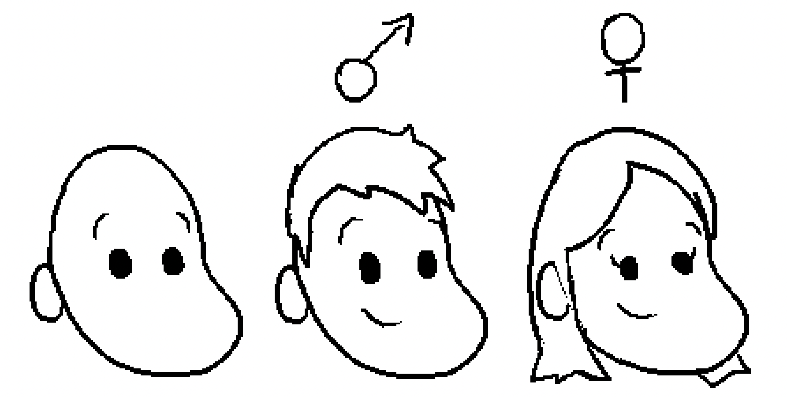

Figura 7: Primeira concept da aprimoração do protagonista.

Figura 8: Esboços dos designs aprimorados do protagonista.

### 3.3.5. Trilha sonora (sprint 4)

*Descreva a trilha sonora do jogo, indicando quais músicas serão utilizadas no mundo e nas fases. Utilize listas ou tabelas para organizar esta seção. Caso utilize material de terceiros em licença Creative Commons, não deixe de citar os autores/fontes.*

*Exemplo de tabela*
\# | titulo | ocorrência | autoria
--- | --- | --- | ---
1 | tema de abertura | tela de início | própria
2 | tema de combate | cena de combate com inimigos comuns | Hans Zimmer
3 | ... 

## 3.4. Inventário e Bestiário (sprint 3)

### 3.4.1. Inventário

\# | item |  | como obter | função | efeito sonoro
--- | --- | --- | --- | --- | ---
1 | Cartão de Identificação (KeyCard) |  | você o obtém após ajudar cada professor-robô a recuperar o controle de sua consciência | Com o acúmulo de quatro deles, dá acesso a áreas restritas dentro da escola e permite o acesso à ultima sala da fase 1 | Som de leitura de cartão
2 | Chave |  | Ela fica disponível na última sala da fase 1 após todos os 4 keycards serem coletados | É utilizada para entrar no elevador para acessar a fase 2 | Som de chave
3 | ... 

### 3.4.2. Bestiário

\# | inimigo |  | ocorrências | função | impacto | efeito sonoro
--- | --- | --- | --- | --- | --- | ---
1 | professora-robô |  |  a partir da fase 1 | aparece e bloqueia o caminho do jogador, soltando ameaças sobre vazar dados da escola. Após alguns segundos de diálogo, o jogador recebe um questionário sobre a LGPD para "desbloqueá-la" e restaurar seu sistema para que ela volte ao normal | se o jogador acerta todas as perguntas, a professora volta ao normal e o jogador aprende mais sobre a LGPD; se o jogador erra, ele precisa refazer até acertar | sons de sistema corrompido (bipes, estática, glitch)
2 | ...

## 3.5. Gameflow (Diagrama de cenas) (sprint 2)

  Diagrama de cenas 
   

## 3.6. Regras do jogo (sprint 3)

#### Objetivo geral do jogo:
 - O jogador precisa superar cada fase completando as tarefas específicas para progredir na história. Seu objetivo final é libertar a escola da invasão hacker.

#### Regras gerais do jogo:
 - O jogador precisa concluir os minigames de uma fase para ter acesso a fase seguinte.
 - Caso o jogador fracasse ao concluir um minigame, ele terá a chance de fazer novamente até acertar.
 - O jogo só vai ser finalizado caso todas as fases e objetivos forem concluídos.
 - Ao decorrer das fases o jogador terá contato com novos conceitos e conhecimentos sobre a LGPD.

#### Regras da **Fase 1**:
 - O jogador deverá interagir com os professores e responder às perguntas com base nos conhecimentos adquiridos anteriormente ao interagir com o faxineiro no início da fase. Para cada resposta correta, ele receberá um keycard. Ao coletar quatro keycards, uma sala especial será desbloqueada, onde encontrará uma chave. Essa chave será utilizada no elevador para acessar a próxima fase.
 - O jogador só irá conseguir um keycard caso ele responda certo duas de três perguntas feitas pelos NPCs.
 - Caso o jogador erre duas perguntas ele terá a chance de respondê-las novamente, até acertar no mínimo duas.
 - Ao conseguir 4 keycards a sala com a chave deverá ser liberada.
 - Para acessar a próxima fase o jogador deve se aproximar da chave e após isso ir até o elevador, automaticamente a transição entre fases ocorrerá.

## 3.7. Mecânicas do jogo (sprint 3)

#### Teclas de movimentação: **W A S D** ou **Setas do Teclado**:
 - **W** ou **Seta para cima**: Movimentação para cima; **S** ou **Seta para baixo**: Movimentação para baixo; **A** ou **Seta para esquerda**: Movimentação para esquerda; **D** ou **Seta para direita**: Movimentação para direita.

#### Tecla de interação com o cenário (portas e objetos): **"Espaço"**: 
 - Use a tecla **"Espaço"** para abrir portas, coletar itens e para demais interações com o cenário.
 - Na primeira fase você deverá user a tecla "espaço" para abrir a porta da sala de faxina, para poder ter acesso ao restante do mapa.

#### Tecla de interação com NPCs: **"E"**:
 - Use a tecla **"E"** para interagir com os NPCs.
 - Na primeira fase você poderá interagir com o NPC do faxineiro, que dará um contexto geral da situação da fase ao personagem e com os NPCs dos professores robôs, que deverão ter seus sistemas reiniciados através de um minigame de perguntas e respostas. 

#### Botão de "Missões":
 - Durante todas as fases, o jogador terá acesso a um botão "Missões", localizado no canto superior direito da tela. Ao clicar nele, poderá visualizar os objetivos específicos da fase atual, garantindo que saiba quais tarefas precisa concluir para avançar no jogo. Isso ajudará na organização das ações e no acompanhamento do progresso rumo à libertação da escola da invasão hacker.

#### Mecânicas da primeira fase:
 - O jogador deve interagir com o NPC do faxineiro para entender o contexto da fase.
 - Após a interação, deverá abrir a porta da sala (pressionando "espaço") e acessar o restante do mapa, onde encontrará os NPCs dos professores robôs.
 - Ao encontrar os professores, deverá interagir com eles (pressionando "e") e participar de um minigame de perguntas e respostas para que possa "reiniciar seus sistemas" e caso seja feito com sucesso, o jogador ganhará 1 keycard.
 - O jogador deverá ajudar os 4 professores para ganhar o total de 4 keycards, para que ele possa acessar uma sala.
 - Ao acessar a sala haverá uma chave, ao se aproximar dela o jogador irá coletá-la automaticamente e deverá ir até o elevador, que dará acesso a fase 2.

   

## 3.8. Implementação Matemática de Animação/Movimento (sprint 4)

*Descreva aqui a função que implementa a movimentação/animação de personagens ou elementos gráficos no seu jogo. Sua função deve se basear em alguma formulação matemática (e.g. fórmula de aceleração). A explicação do funcionamento desta função deve conter notação matemática formal de fórmulas/equações. Se necessário, crie subseções para sua descrição.*

# 4. Desenvolvimento do Jogo

## 4.1. Desenvolvimento preliminar do jogo (sprint 1)

A primeira versão do jogo foi desenvolvida com foco na implementação das mecânicas essenciais, garantindo que a estrutura básica estivesse funcional. Durante essa fase inicial, trabalhamos na movimentação do personagem, na interação com NPCs, no sistema de combate baseado em perguntas e respostas sobre a Lei Geral de Proteção de Dados (LGPD) e na estruturação da primeira fase dentro do cenário escolar.

Em termos de código, foi implementado um sistema de movimentação utilizando as teclas WASD, permitindo que o jogador navegue pelo ambiente do jogo de forma fluida. Além disso, foi criada a mecânica de interação com personagens não jogáveis (NPCs), possibilitando diálogos que fornecem informações e desafios ao jogador. O combate foi desenvolvido com um modelo inovador de perguntas e respostas, no qual o progresso depende do conhecimento do jogador sobre LGPD. Caso acerte as respostas, o jogador avança; caso contrário, perde pontos ou enfrenta consequências dentro do jogo.

A estrutura das fases foi pensada para representar os três andares de uma escola, onde cada fase corresponde a um andar. Isso cria uma progressão lógica e imersiva, incentivando o jogador a explorar novos desafios conforme avança. Essa abordagem contribui para a ambientação e narrativa do jogo, tornando a experiência mais envolvente.

### Ilustrações e Prints de Tela

  
  
  
  
  

### Dificuldades Encontradas
Durante o desenvolvimento, algumas dificuldades foram identificadas. A implementação do sistema de diálogos exigiu ajustes para garantir que os textos fossem exibidos corretamente e fluíssem de maneira natural. No sistema de combate, um dos desafios foi equilibrar a dificuldade das perguntas para que o jogo permanecesse desafiador sem ser frustrante. Além disso, alguns problemas técnicos surgiram na movimentação do personagem, como colisões inesperadas e ajustes na resposta do teclado.

Outra questão foi o design das fases. Criar um ambiente escolar que fosse visualmente interessante e intuitivo para navegação exigiu várias iterações. Ainda estamos aprimorando a disposição dos elementos no cenário para tornar a progressão mais clara ao jogador.

Os próximos passos incluem a melhoria do sistema de combate, tornando as perguntas mais dinâmicas, a expansão dos diálogos com NPCs para enriquecer a interação, o refinamento dos cenários e fases para uma progressão mais intuitiva, além da correção de bugs e otimização do código. Também planejamos adicionar trilha sonora e efeitos visuais para aumentar a imersão do jogador.

## 4.2. Desenvolvimento básico do jogo (sprint 2)

Durante o sprint 2, focamos em aprimorar o personagem principal e introduzir novos personagens, o que enriqueceu a narrativa e a jogabilidade do jogo. Os novos personagens foram integrados de forma a complementar a história, trazendo diversidade e ampliando as possibilidades de interação.
Além disso, criamos e implementamos diálogos entre os personagens. Essa funcionalidade foi essencial para tornar a experiência do jogador mais imersiva, permitindo o desenvolvimento da trama de forma mais dinâmica. A implementação envolveu a construção de um sistema básico de diálogos, com ramificações que afetam o progresso do jogador.
Outro ponto importante deste sprint foi o aprimoramento e a conclusão da fase 01. Foram feitos ajustes no design do cenário, correção de bugs e otimização da mecânica de jogo, garantindo uma experiência fluida e envolvente para o jogador.

Dificuldades Encontradas:

- Ajuste preciso da sincronização dos diálogos com as ações dos personagens.
- Problemas de desempenho ao adicionar novos personagens, exigindo otimização do código.
- Balanceamento da dificuldade da fase 01 para manter o jogo desafiador, mas acessível.

Próximos Passos:
- Implementação da fase 02, com novos desafios e ambientes.
- Melhoria no sistema de diálogos, incluindo opções de resposta mais complexas.
- Testes de jogabilidade para refinar a experiência do usuário.

Ilustrações do Desenvolvimento:
 
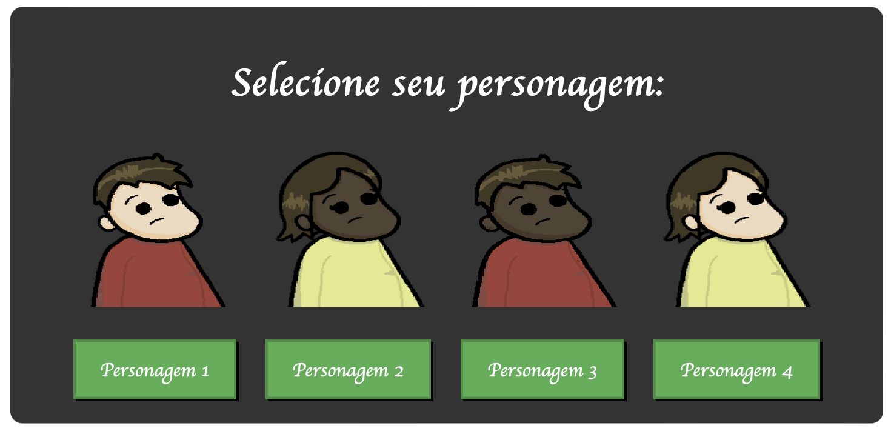
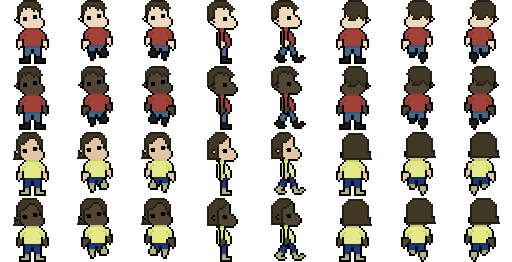
 
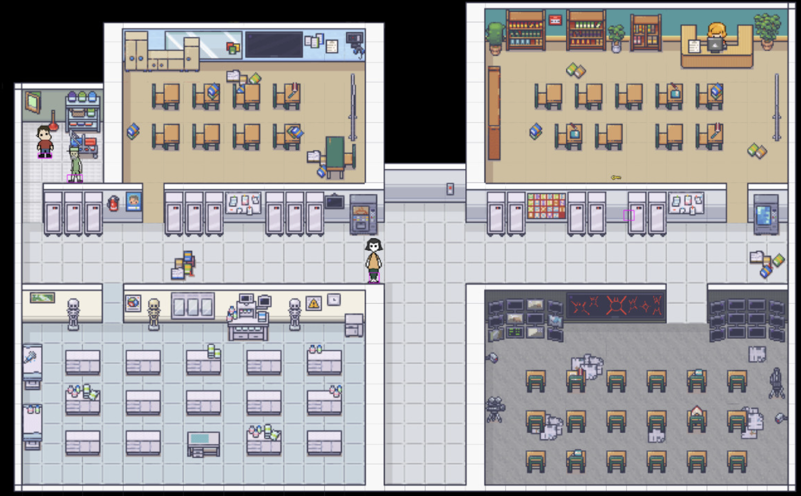
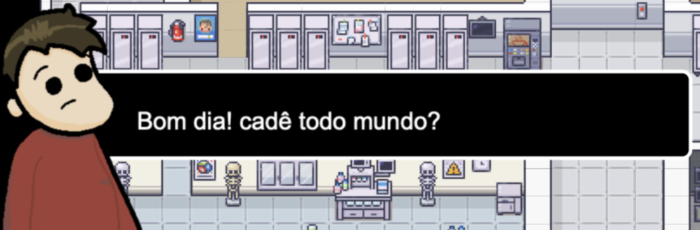

## 4.3. Desenvolvimento intermediário do jogo (sprint 3)

*Descreva e ilustre aqui o desenvolvimento da versão intermediária do jogo, explicando brevemente o que foi entregue em termos de código e jogo. Utilize prints de tela para ilustrar. Indique as eventuais dificuldades e próximos passos.*

Em termos de código, os principais pontos do desenvolvimento foram:

## Minigames

O jogo ja se encontra com 4 mini games na fase 1

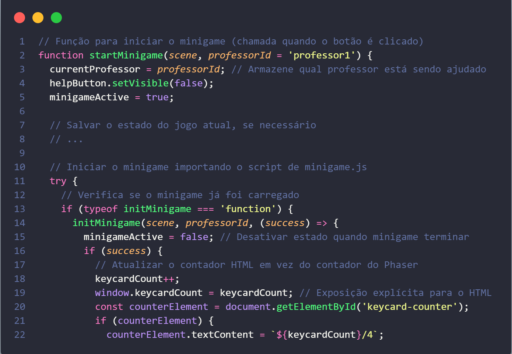
código de implementação dos mini games

## Diálogos dos npcs

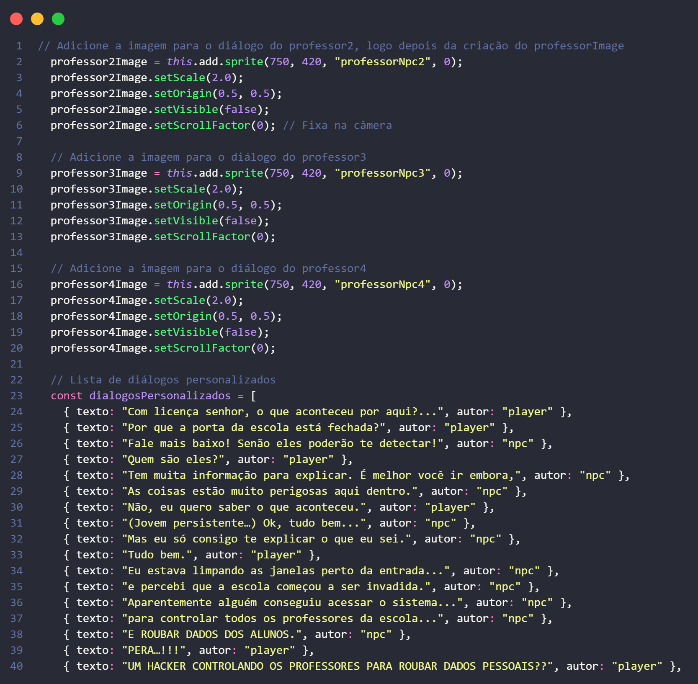
código de texto dos diálogos com o faxineiro

## HUD

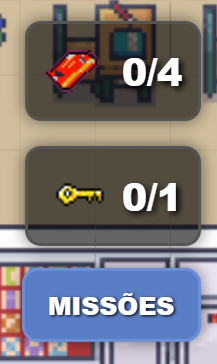 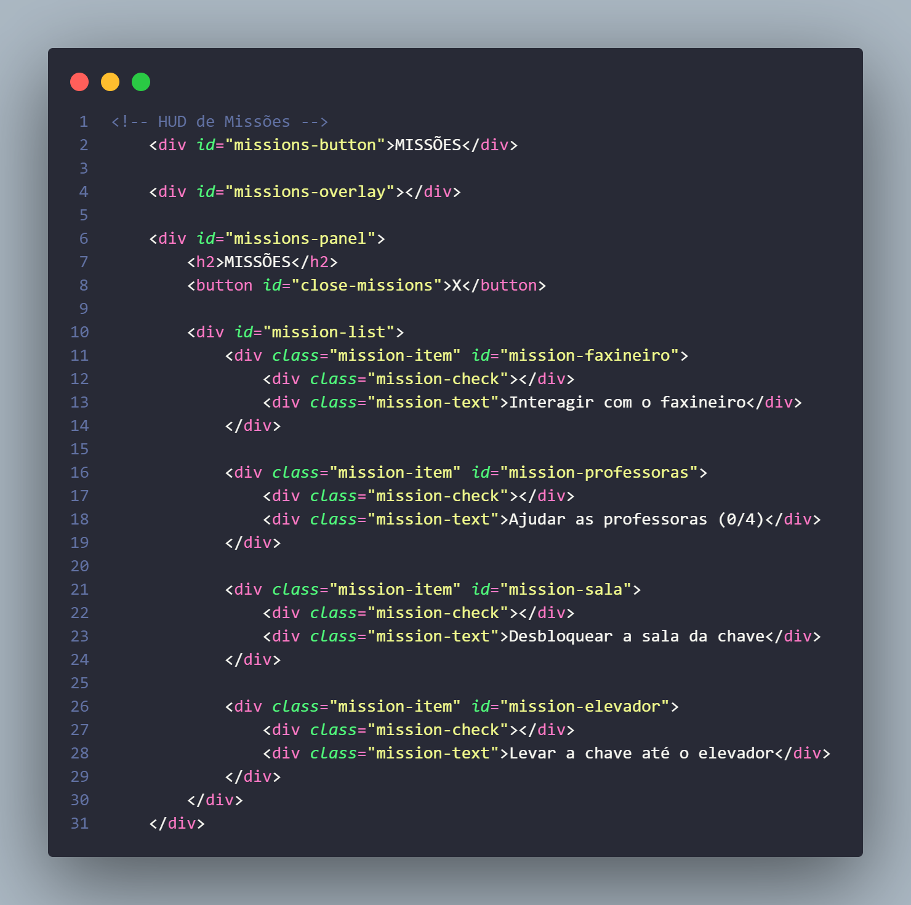
Código da implementação da Hud de missões

## Próximos passos

Para a próxima sprint, até o momento, a ideia é focar no desenvolvimento de um sistema de criação de personagens para aumentar a diversidade, além da implementação de efeitos sonoros e músicas que se encaixam na arte do jogo.

Além disso, vamos definir as mecânicas principais da fase 2, que se passa na biblioteca.

## 4.4. Desenvolvimento final do MVP (sprint 4)

*Descreva e ilustre aqui o desenvolvimento da versão final do jogo, explicando brevemente o que foi entregue em termos de MVP. Utilize prints de tela para ilustrar. Indique as eventuais dificuldades e planos futuros.*

## 4.5. Revisão do MVP (sprint 5)

*Descreva e ilustre aqui o desenvolvimento dos refinamentos e revisões da versão final do jogo, explicando brevemente o que foi entregue em termos de MVP. Utilize prints de tela para ilustrar.*

# 5. Testes

## 5.1. Casos de Teste (sprints 2 a 4)

A tabela abaixo apresenta os casos de teste comuns que podem ser executados a qualquer momento para testar o funcionamento e a integração das partes do jogo.

\# | Pré-condição | Descrição do Teste | Pós-condição
--- | --- | --- | ---
1 | Posicionar o jogo na tela de abertura | Iniciar o jogo desde seu início | O jogo deve iniciar da fase 1.
2 | Posicionar o personagem próximo a um item coletável | Movimentar o personagem para coletar o item | O item deve ser removido do cenário e o efeito de coleta deverá aplicado.
3 | Estar na fase e pegar a chave | Aproxime-se do elevador com a chave que ficará flutuando ao lado do personagem | O jogo deve acionar a transição e avançar para a próxima fase.
4 | Posicionar o personagem próximo a um NPC interativo | Iniciar diálogo com o NPC | O diálogo deve ser exibido dentro da caixa de diálogo, com a opção de avançar a conversa usando a tecla "E".
5 | Carregar um jogo salvo anteriormente | Iniciar a jogabilidade a partir do ponto salvo | O jogo deve carregar o progresso salvo corretamente, restaurando posição do personagem, itens coletados e status das fases sem falhas ou perda de dados."

Esses testes garantem que as principais mecânicas do jogo estejam funcionando corretamente ao longo do desenvolvimento e das iterações nas sprints 2 a 4.

## 5.2. Testes de jogabilidade (playtests) (sprint 4)

### 5.2.1 Registros de testes

*Descreva nesta seção as sessões de teste/entrevista com diferentes jogadores. Registre cada teste conforme o template a seguir.*

Nome | João Jonas (use nomes fictícios)
--- | ---
Já possuía experiência prévia com games? | sim, é um jogador casual
Conseguiu iniciar o jogo? | sim
Entendeu as regras e mecânicas do jogo? | entendeu as regras, mas sobre as mecânicas, apenas as essenciais, não explorou os comandos complexos
Conseguiu progredir no jogo? | sim, sem dificuldades  
Apresentou dificuldades? | Não, conseguiu jogar com facilidade e afirmou ser fácil
Que nota deu ao jogo? | 9.0
O que gostou no jogo? | Gostou  de como o jogo vai ficando mais difícil ao longo do tempo sem deixar de ser divertido
O que poderia melhorar no jogo? | A responsividade do personagem aos controles, disse que havia um pouco de atraso desde o momento do comando até a resposta do personagem

### 5.2.2 Melhorias

*Descreva nesta seção um plano de melhorias sobre o jogo, com base nos resultados dos testes de jogabilidade*

# 6. Conclusões e trabalhos futuros (sprint 5)

*Escreva de que formas a solução do jogo atingiu os objetivos descritos na seção 1 deste documento. Indique pontos fortes e pontos a melhorar de maneira geral.*

*Relacione os pontos de melhorias evidenciados nos testes com plano de ações para serem implementadas no jogo. O grupo não precisa implementá-las, pode deixar registrado aqui o plano para futuros desenvolvimentos.*

*Relacione também quaisquer ideias que o grupo tenha para melhorias futuras*

# 7. Referências (sprint 5)

Links vistos na seção 1.1.1:
Abstartups. Disponível em: [Art](https://abstartups.com.br/wp-content/uploads/2022/11/MAPEAMENTO-EDTECH-1.pdf) Acesso em: 27/02/2025

LUCK, Heloisa. Liderança em gestão escolar. 4. ed. Petrópolis: Vozes, 2010.  
SOBRENOME, Nome. Título do livro: subtítulo do livro. Edição. Cidade de publicação: Nome da editora, Ano de publicação.  

INTELI. Adalove. Disponível em: https://adalove.inteli.edu.br/feed. Acesso em: 1 out. 2023  
SOBRENOME, Nome. Título do site. Disponível em: link do site. Acesso em: Dia Mês Ano

# Anexos

*Inclua aqui quaisquer complementos para seu projeto, como diagramas, imagens, tabelas etc. Organize em sub-tópicos utilizando headings menores (use ## ou ### para isso)*
