# GDD - Game Design Document - Módulo 1 - Inteli

## CyberTech

#### André David Katz, Celso Rodrigues Rocha Júnior, Daniel Meiches, Kaian Santos Moura, Luiz Gustavo Borges Oliveira, Miguel Ferreira de Siqueira Almeida e Wendel Hebert Feitosa.


## Sumário

[1. Introdução](#c1)

[2. Visão Geral do Jogo](#c2)

[3. Game Design](#c3)

[4. Desenvolvimento do jogo](#c4)

[5. Casos de Teste](#c5)

[6. Conclusões e trabalhos futuros](#c6)

[7. Referências](#c7)

[Anexos](#c8)

<br>


# <a name="c1"></a>1. Introdução (sprints 1 a 4)

## 1.1. Plano Estratégico do Projeto

### 1.1.1. Contexto da indústria (sprint 2)

O mercado de educação digital está se tornando cada vez mais competitivo, com gigantes como Microsoft e Apple oferecendo soluções educacionais semelhantes por via do Office e do Apple Education, respectivamente. Startups de EdTech também trazem inovações constantes no mercado. De acordo com um Mapeamento de startups feito pela Abstartups, em 2022 foram identificadas 813 startups de EdTech ativas no Brasil, que é 44% mais startups comparado com 2021. As escolas e universidades estão em busca de ferramentas mais integradas e fáceis de usar, especialmente com o crescimento do ensino híbrido e remoto. As novas tecnologias, como inteligência artificial e aprendizagem adaptativa, estão mudando rapidamente o cenário e oferecendo grandes oportunidades para empresas como o Google for Education se destacarem. No entanto, essa inovação também exige atenção às regulamentações de privacidade e segurança, que estão ficando cada vez mais rigorosas em diversos países. Para continuar relevante, o Google for Education precisa se adaptar rapidamente às necessidades emergentes das instituições educacionais de todo o mundo, pois suas atividades se estendem por diversos países e necessitam estar atento às mudanças legais, sem perder de vista a crescente concorrência no setor.

### 1.1.1.1. Modelo de 5 Forças de Porter (sprint 2)

#### - Análise da Ameaça de Novos Entrantes:
A ameaça de novos entrantes no mercado de tecnologias educacionais é significativa, especialmente com o crescimento de startups e empresas que buscam atender à crescente demanda por soluções digitais no setor educacional, porém é dificultada por barreiras como altos custos iniciais, exigências regulatórias (como a LGPD) e a fidelização dos usuários a plataformas consolidadas. Entretanto, o Google for Education mantém uma posição consolidada, oferecendo um ecossistema abrangente de ferramentas integradas que facilitam a adoção por instituições de ensino. Além disso, a empresa investe continuamente em tecnologias emergentes, como inteligência artificial, realidade virtual e aumentada, fortalecendo sua oferta e criando barreiras para novos concorrentes. A reputação estabelecida e a capacidade de inovação do Google for Education tornam desafiadora a entrada de novos players que desejam competir em igualdade de condições.

#### - Análise da Ameaça de Produtos ou Serviços Substitutos:
A ameaça de produtos ou serviços substitutos para o Google for Education é moderada, dado o número crescente de alternativas no mercado de tecnologias educacionais. Plataformas como Canvas, Edmodo e Moodle oferecem sistemas de gestão de aprendizagem com funcionalidades semelhantes, permitindo que instituições de ensino gerenciem cursos, distribuam conteúdo e avaliem o desempenho dos alunos. Além disso, ferramentas como o Microsoft Teams estão sendo cada vez mais adotadas em ambientes educacionais, proporcionando recursos integrados de comunicação e colaboração. No entanto, o Google for Education mantém uma posição competitiva sólida devido à sua integração perfeita com outros serviços do Google, facilidade de uso e uma base de usuários já estabelecida, o que dificulta a substituição completa por alternativas.

#### - Análise do Poder de Barganha dos Fornecedores: 
O poder de barganha dos fornecedores em relação ao Google for Education é baixo, pois a empresa possui uma infraestrutura tecnológica própria, incluindo uma vasta rede de data centers, reduzindo sua dependência externa. Além disso, colabora com múltiplos fabricantes de hardware, como os de Chromebooks, e mantém parcerias estratégicas globais para distribuir e integrar suas soluções educacionais. Essa diversificação enfraquece a influência de fornecedores individuais, permitindo ao Google maior controle sobre custos e inovações. A empresa também incentiva a colaboração com parceiros para vender produtos, oferecer serviços e criar soluções dentro de seu ecossistema, ampliando suas ofertas educacionais e consolidando sua posição no mercado. 

#### - Análise do Poder de Barganha dos Clientes:
O poder de barganha dos clientes em relação ao Google for Education é moderado. Embora a empresa ofereça ferramentas gratuitas, como o Google Workspace for Education Fundamentals, que incluem aplicativos como Documentos, Planilhas e Apresentações, as instituições de ensino podem optar por soluções alternativas, como Microsoft 365 Education ou plataformas de código aberto, caso suas necessidades não sejam atendidas. Para aumentar o valor percebido e incentivar a adoção de suas soluções, o Google for Education disponibiliza complementos pagos, como o Gemini Education e o Gemini Education Premium, que oferecem recursos avançados de inteligência artificial generativa. Além disso, a empresa mantém uma rede de mais de 4.000 especialistas para auxiliar escolas na implementação eficaz de suas tecnologias. Essas iniciativas buscam fortalecer a lealdade dos clientes e reduzir seu poder de barganha.

#### - Análise da Rivalidade entre os Concorrentes Existentes:
A rivalidade entre os concorrentes no mercado de tecnologias educacionais é intensa, com o Google for Education enfrentando competidores significativos. Plataformas como Canvas LMS, que detém 7,75% do mercado, e RenWeb, com 7,05%, oferecem sistemas de gestão de aprendizagem robustos e amplamente adotados. Além disso, alternativas como Kami, Flipgrid e Lockdown Browser proporcionam funcionalidades específicas que competem diretamente com as ferramentas do Google for Education. A presença de soluções de código aberto, como o Moodle, e ofertas de grandes corporações, como o Microsoft Teams, também intensificam a competição, oferecendo opções diversificadas para instituições de ensino. Para manter sua posição de destaque, o Google for Education investe continuamente na integração de suas ferramentas, na expansão de recursos e no fortalecimento de parcerias estratégicas, buscando atender às necessidades dinâmicas do setor educacional. 


### 1.1.2. Análise SWOT (sprint 2)

Entre as forças do Google for Education, destacam-se a credibilidade da marca Google, a integração de suas ferramentas com outros serviços do Google como Drive e Docs e a facilidade de uso que torna suas soluções populares em escolas e universidades. No entanto, suas fraquezas incluem a dependência de uma conexão de internet estável, o que pode ser um desafio em áreas com infraestrutura limitada, além de dificuldades na personalização de ferramentas para diferentes necessidades educacionais. As oportunidades são amplas, com o crescimento do mercado de educação digital e o potencial de integrar tecnologias emergentes, como inteligência artificial, para aprimorar a experiência de aprendizagem. Por outro lado, as ameaças incluem a forte concorrência de outras empresas como Microsoft e Apple, que também oferecem soluções educacionais populares, e as preocupações crescentes com a privacidade e segurança dos dados dos alunos, especialmente em face de regulamentações cada vez mais rigorosas.


### 1.1.3. Missão / Visão / Valores (sprint 2)

A missão deste projeto é educar alunos e professores de forma divertida e envolvente sobre a importância da Lei Geral de Proteção de Dados LGPD  enquanto eles jogam um RPG sobre um aluno tentando impedir um hacker de roubar dados de sua escola. Durante a jornada, os jogadores terão que responder perguntas sobre a LGPD para libertar as salas trancadas e enfrentar desafios, tornando a educação sobre privacidade algo prático e empolgante. A visão é usar a narrativa de uma invasão hacker para mostrar de forma clara e dinâmica como a proteção de dados afeta nosso cotidiano, incentivando os jogadores a se tornarem mais conscientes e responsáveis no uso da tecnologia. Os valores do jogo são a promoção da privacidade, a segurança da informação e a ética digital, com o objetivo de criar uma experiência que vai além do entretenimento, tornando os jogadores mais preparados para lidar com os desafios da era digital.

### 1.1.4. Proposta de Valor (sprint 4)


### 1.1.5. Descrição da Solução Desenvolvida (sprint 4)

Pensando na dor do parceiro, foi desenvolvido um jogo 2D do gênero RPG, visando educar alunos e professores de escolas públicas sobre o que é a LGPD e sua importância. Tendo em mente que parte do nosso público nunca teve contato com esse tema, buscamos alinhar uma solução didática, divertida e imersiva, pois sabemos que o tema da LGPD é algo denso, então precisávamos buscar uma forma de educar as crianças com um jogo que as entretessem ao mesmo tempo que as educassem. O projeto foi construído buscando estar alinhado com os valores do nosso parceiro Google for Education, valorizando a interatividade, a diversidade e o ambiente escolar. O nosso produto gera seu valor no mercado ao combinar uma proposta didática eficiente com diversão, pois todas as fases do jogo foram elaboradas visando a imersão e conscientização do aluno ou do professor com elementos comuns em video-games. Por exemplo: na primeira fase do jogo, diálogos com NPCs apresentarão conceitos básicos da LGPD ao jogador e os conhecimentos adquiridos serão testados através de minigames, buscando a fixação do conteúdo. No decorrer do jogo, as informações serão mais profundas e serão sempre "testadas" através de minigames para que o aluno não só aprenda, mas também coloque em prática os conceitos aprendidos.

### 1.1.6. Matriz de Riscos (sprint 4)


| \#  | Ameaças | Impacto | Plano de Ação |
| --- | --- | --- | --- |
| 1: | Má gestão de tempo. | Atraso na conclusão de tarefas e entrega nos prazos. | Seguir à risca o planejamento feito nas Dailies e seguir a planilha de organização de tarefas e prazos.
| 2: | Falta de comunicação. | Desperdício de tempo em tarefas já designadas e discussão de ideias já definidas. | Fazer uma retrospectiva do dia anterior durante as Dailies, alinhando o que foi feito e o que será feito durante o dia.
| 3: | Falta de foco. | Baixa produtividade e desperdício de tempo em assuntos paralelos em horário de desenvolvimento, desrespeitando os prazos. | O Scrum Master deve ter a habilidade de perceber quando o grupo está se distraindo e conseguir voltar a atenção de todos ao trabalho novamente.
| 4: | Ferramentas ficarem off-line. | Impossibilidade de fazer "commits", continuar o código ou salvar alguma informação. | Fazer cópias locais dos arquivos e deixar o que foi interrompido organizado para dar continuidade quando possível.
| 5: | Ausência nos momentos de desenvolvimento. | Atraso nas realizações de tarefas e sobrecarga de outros membros do grupo. | Evitar faltar por motivos que poderiam ser evitados e caso seja necessário avisar com antecedência para o grupo poder se organizar. 
| 6: | Quedas de Internet. | Risco de perder algum progresso não salvo e não conseguir enviar alguma tarefa. | Fazer "saves" do progresso durante o processo e não apenas na finalização. Caso seja necessário enviar algo, avisar o grupo para alguém assumir a função de envio.
| 7: | Atraso na entrega de um artefato. | Queda na reputação com o parceiro, atraso relevante na entrega final e perda de nota do artefato. | O grupo deve estar sempre alinhado com os prazos, caso um membro enfrente alguma dificuldade que "trave" o desenvolvimento, deverá consultar os membros do grupo ou os professores.
| 8: | Chuvas. | As chuvas podem causar quedas de energia impossibilitando o trabalho e dificuldade de chegar até a faculdade. | Caso a energia caia e o membro não consiga dar continuidade às tarefas, o membro deverá comunicar o grupo e se organizar para pôr tudo em ordem o quanto antes para não causar atrasos.

| \#  | Oportunidades | Impacto | Plano de Ação |
| --- | --- | --- | --- |
| 9: | Aprendizado. | O desenvolvimento e o aprendizado estão extremamente ligados pois à medida que aprendemos desenvolvemos e quando desenvolvemos aprendemos, sempre através de aulas, autoestudos, cursos, etc. | Todos os membros do grupo devem identificar quais áreas têm dificuldade e quais têm facilidade e assim sempre dando prioridade a cumprir tarefas nas áreas que tem dificuladade, assim gerando necessidade de aprender.
| 10: | Engajamento. | Quando o grupo está engajado todos estão cumprindo com suas obrigações, realizando as tarefas e as entregando dentro dos prazos, isso faz com que o projeto ande e que todos possam evoluir juntos. | Designar as tarefas pensando em deixar cada membro responsável por tarefas que sejam de áreas que os façam com que se sintam desafiados, para que saiam da sua zona de conforto e possam se sentir engajados a aprender.
| 11: | Workshops/Aulas para aprimoramento de habilidades técnicas. | Ter orientações extras sobre temas que são necessários para o desenvolvimento é uma ótima maneira para evoluir habilidades técnicas, podendo revisar conteúdos que possam ter passado e deixado dúvidas. | Sempre ir atrás de identificar áreas que temos dificuldade e caso tivermos, encaminhar esses itens para a orientação para eles poderem analisar a possibilidade de ter alguma instrução extra sobre o tema.
| 12: | Boa liderança. | Quando há um bom Scrum Master a sprint anda de maneira fluida e organizada, com todos os membros do grupo cumprindo com suas obrigações para a conclusão do projeto.| Para ser um bom Scrum Master é necessário identificar as dificuldades do grupo e poder ter uma visão crítica sobre essas questões, visando superar as adversidades.
| 13: | Consultar professores. | Caso tenha algum impasse no grupo ou dificuldade para o cumprimento de alguma tarefa ou entendimento de algum conteúdo que contribua para a conclusão de um artefato do projeto, os professores sempre estão prontos para nos ajudar e resolverem nossas dúvidas. | Devemos sempre deixar o grupo ciente das dificuldades enfrentadas para que possamos analisar e caso seja necessário consultar algum professor.
| 14: | Utilizar métodos ágeis. | Utilizar métodos ágeis permite que nossa organização seja mais eficiente e que possamos otimizar nosso tempo de desenvolvimento. | Estar sempre atento aos métodos apresentados pela orientadora e quando for a hora de botá-los em prática devemos fazer com atenção. 
| 15: | Aproveitamento dos momentos de Dailies. | Aproveitar os momentos de Dailies permite que o grupo esteja alinhado nas tarefas, prazos, dúvidas e tudo que abranje o projeto, possibilitando uma maior fluidez no desenvolvimento do jogo. | Devemos sempre manter o foco durante esses encontros e caso o scrum master perceba que o grupo não está engajado no momento deverá ser capaz de atrair a atenção de todos de volta. Caso algum membro do grupo esteja ausente durante a daily, o que foi dito deverá ser passado para ele por meio de mensagens.

### 1.1.7. Objetivos, Metas e Indicadores (sprint 4)

### Uma meta S.M.A.R.T para nosso projeto: 
Meta 1 - Finalizar o MVP do jogo educativo

Específica: Desenvolver um jogo 2D educativo sobre LGPD para alunos e professores de escolas públicas.

Mensurável: O jogo deve conter no mínimo três fases interativas com minigames e diálogos educativos.

Alcançável: O escopo do jogo está planejado considerando o tempo e os recursos disponíveis.

Relevante: Ensinar LGPD de forma lúdica e acessível, alinhado aos valores do Google for Education.

Temporal: Entrega final até 11 de abril de 2025.

Meta 2 - Garantir qualidade e avaliação positiva

Específica: Alcançar uma nota média mínima de 8,5 nos artefatos do projeto.

Mensurável: Acompanhar avaliações dos professores e feedbacks ao longo do desenvolvimento.

Alcançável: Melhorar iterativamente o jogo com base nos feedbacks recebidos.

Relevante: A nota reflete a qualidade e a didática do jogo, validando seu impacto educacional.

Temporal: Monitoramento contínuo até a entrega final em abril de 2025.

Meta 3 - Criar uma experiência interativa e envolvente

Específica: Implementar elementos de gamificação (diálogos, desafios e minigames) para reforçar o aprendizado.

Mensurável: Cada fase deve conter pelo menos um minigame que teste conhecimentos adquiridos.

Alcançável: Desenvolver mecânicas simples, porém eficazes, dentro do tempo disponível.

Relevante: O engajamento dos alunos e professores será essencial para a efetividade do jogo.

Temporal: Implementação ao longo das sprints, com testes antes da entrega final.

## 1.2. Requisitos do Projeto (sprints 1 e 2)

Os requisitos do projeto descrevem as funcionalidades essenciais para o desenvolvimento do jogo, garantindo seu correto funcionamento. Eles incluem mecânicas básicas, como movimentação e interação, além de elementos específicos da jogabilidade, como o sistema de combate baseado em perguntas sobre a LGPD. Esses requisitos são fundamentais para estruturar a experiência do jogador e assegurar a coerência do jogo dentro do seu tema e objetivo educacional.

Abaixo está todos os requisitos que trabalhamos na sprint 1 e 2.

| \#  | Requisito | Descrição  |
| --- | --- | --- |
| 1 | Controle do personagem | O jogador pode mover o personagem utilizando as teclas WASD ou setas direcionais para movimentação. |
| 2 | Interação com NPCs | Durante a exploração, o jogador pode conversar com personagens do jogo apertando a tecla 'E' para obter informações e avançar na narrativa. |
| 3 | Combate baseado em perguntas e respostas sobre LGPD | Durante os confrontos, o jogador precisará responder corretamente a perguntas sobre a Lei Geral de Proteção de Dados (LGPD) para vencer os desafios. |
| 4 | Divisão do jogo em fases | O jogo será dividido em três fases representando os andares de uma escola, totalizando três andares com desafios progressivos. |
| 5 | História baseada na proteção de dados dentro de uma escola | O jogador assume o papel de um estudante que deve proteger os dados da escola contra ameaças cibernéticas, aprendendo sobre os conceitos da LGPD. |
| 6 | Progressão baseada na complexidade das perguntas e desafios | À medida que o jogador avança, as perguntas abordam conceitos mais aprofundados da LGPD. |
| 7 | Aprimoramento de personagem | Implementação de melhorias na jogabilidade e características do personagem. 
| 8 | Criação de personagem feminino | Adição de uma opção de personagem jogável do gênero feminino. |
| 9 | Tileset | Desenvolvimento de um conjunto de tiles para compor os cenários do jogo. |
| 10 | Mapa da fase 01 | Criação do mapa completo da primeira fase do jogo. |
| 11 | Contextualização da indústria do mercado | Introdução ao contexto mercadológico da LGPD no jogo. |
| 12 | Análise da ameaça de novos entrantes | Estudo sobre como novos concorrentes podem afetar a proteção de dados. |
| 13 | Análise da ameaça de produtos ou serviços substitutos | Investigação sobre soluções alternativas que impactam a LGPD. 
| 14 | Análise do poder de barganha dos fornecedores | Avaliação do impacto dos fornecedores na segurança de dados. |
| 15 | Análise do poder de barganha dos clientes | Estudo do impacto dos clientes na gestão de dados. |
| 16 | Análise da rivalidade entre concorrentes existentes | Análise da competição no mercado de segurança de dados. |
| 17 | Análise SWOT | Identificação de forças, fraquezas, oportunidades e ameaças. |
| 18 | Missão, visão e valores | Definição da identidade e propósito do jogo. |
| 19 | Referências e fontes de pesquisa | Inclusão de fontes usadas no desenvolvimento do jogo. |
| 20 | Nova cena | Implementação de uma nova cena no jogo. |
| 21 | NPC 'faxineiro' | Criação do NPC faxineiro e sua interação com o jogador. |
| 22 | NPC 'professor' | Criação do NPC professor e sua interação com o jogador. |
| 23 | Implementação de mecânicas | Desenvolvimento de novas mecânicas de jogabilidade. |
| 24 | Diálogos | Criação de interações de diálogo para NPCs. |
| 25 | Novo mapa/cena | Desenvolvimento de um novo mapa para exploração. |
| 26 | Tela de fases | Criação de uma tela para seleção de fases. |
| 27 | Controle de movimento do personagem | Implementação de um sistema responsivo de movimentação para o personagem. |

## 1.3. Público-alvo do Projeto (sprint 2)

De acordo com o nosso parceiro, nosso público abrange alunos, com idades entre 9 e 17 anos, e professores de escolas públicas. Esses alunos estão em diferentes etapas do ensino fundamental e médio, podendo ter distintos níveis de familiaridade com a temática abordada pelo projeto. Já os professores atuam como facilitadores no processo de aprendizado, auxiliando na implementação das atividades e no engajamento dos estudantes. O projeto busca atender às necessidades desse público, oferecendo materiais e metodologias adequadas à sua realidade educacional.

# <a name="c2"></a>2. Visão Geral do Jogo (sprint 2)

## 2.1. Objetivos do Jogo (sprint 2)

O jogo está distribuído em 3 fases. O objetivo final é levar o protagonista até o Data Center da escola, localizado no terceiro andar, para impedir que um hacker faça o upload dos dados de todos. Para avançar, cada fase terá seu próprio item coletável que o jogador vai usar para desbloquear acesso ao elevador da escola, o levando até o próximo piso da escola. Por exemplo: a primeira fase contém 4 keycards espalhados pelo mapa, protegidos por professores robôs que foram hackeados. O jogador precisa coletar todos os keycards para desbloquear a última sala da fase, onde encontrará a chave que permite o acesso à próxima fase.

## 2.2. Características do Jogo (sprint 2)

### 2.2.1. Gênero do Jogo (sprint 2)

O jogo Data Quest se enquadra no gênero RPG (Role-Playing Game), no qual os jogadores assumem o papel de um protagonista aluno e avançam na história ao enfrentar desafios e interagir com o ambiente. O jogador vai enfrentar desafios na forma de minigames, que podem variar entre um quiz e um jogo de classificar tipos específicos de dados.

### 2.2.2. Plataforma do Jogo (sprint 2)

O jogo Data Quest será desenvolvido para garantir compatibilidade tanto com desktop quanto com dispositivos móveis, permitindo que os jogadores possam acessá-lo de forma prática e flexível. Para assegurar uma experiência fluida e acessível, o jogo será projetado para rodar diretamente em navegadores da web, sem necessidade de instalação adicional. Os navegadores compatíveis incluem Google Chrome, Opera, Firefox, Safari e Microsoft Edge, garantindo um amplo suporte para diferentes sistemas operacionais e preferências dos usuários.

### 2.2.3. Número de jogadores (sprint 2)

O jogo Data Quest foi projetado para ser uma experiência single-player, oferecendo suporte exclusivo para um único jogador. Todo o desenvolvimento do jogo, incluindo as mecânicas, a progressão e os desafios foi pensado para proporcionar uma jornada individual imersiva. Isso permite que o jogador explore a narrativa, enfrente inimigos e supere obstáculos sem a necessidade de interação com outros jogadores em tempo real.

### 2.2.4. Títulos semelhantes e inspirações (sprint 2)

O desenvolvimento de Data Quest foi inspirado em títulos específicos que serviram como referência tanto para a mecânica quanto para a estética do projeto. As principais influências incluem:

- Pokémon: O estilo visual dos mapas do jogo e a trilha sonora foram inspiradas por jogos mais antigos da franquia, como Pokémon Fire Red e Pokémon Emerald. Achamos que seria bom para o nosso jogo se pudermos nos basear em um dos RPGs mais acessíveis do mundo, que conta uma estética visual retro, que é algo que queremos emular.
- Undertale: A estética visual do jogo, incluindo o design gráfico e as animações das sprites do protagonista, foi influenciada por Undertale. Elementos como pixel art e expressões dinâmicas foram utilizados para trazer personalidade e carisma ao personagem principal, criando uma experiência visual única e envolvente.

### 2.2.5. Tempo estimado de jogo (sprint 5)

*a ser definido*

# <a name="c3"></a>3. Game Design (sprints 2 e 3)

## 3.1. Enredo do Jogo (sprints 2 e 3)

Em um dia comum de aula na escola Bitshine, um hacker com um plano bem elaborado invade a instituição e toma controle dos sistemas internos, trancando as portas de entrada e as salas de aula com alunos dentro. Superando esses obstáculos, ele avança até o quinto e último andar, onde se encontra o Data Center que abriga os servidores com informações sensíveis sobre alunos, professores e a própria escola. O hacker assume o controle dos professores robôs, programados para ensinar os alunos.

Nosso protagonista, estudante da Bitshine, perde a hora e é acordado apressadamente para se dirigir à escola. Chegando lá, não encontra opções de entrada, mas percebe uma janela que está aberta que leva até a sala do faxineiro da escola. Dentro da sala, o protagonista e o faxineiro têm uma conversa que contextualiza o conflito da Bitshine e ensina os básicos da LGPD para o jogador.

Desse ponto, o jogador, controlando o protagonista, vai progredir por cada andar coletando itens que lhe darão acesso aos diferentes andares da instituição. Ao longo do enredo, o jogador vai encontrar novos desafios que testarão seus conhecimentos sobre a LGPD. O objetivo final do protagonista é impedir o sucesso dos planos do hacker e libertar os alunos e professores das salas trancadas, enquanto o jogador aprende sobre a LGPD e a importância da proteção de dados pessoais.

## 3.2. Personagens (sprints 2 e 3)

### 3.2.1. Controláveis

Os jogadores poderão escolher entre seis personagens disponíveis, que representarão alunos desajeitados que enfrenta dificuldades com horários e costuma não prestar atenção nas aulas. No entanto, ao longo do jogo, essa falta de atenção se transforma em uma vantagem, pois os personagens se encontram em uma situação em que esses conhecimentos aparentemente negligenciados se tornam suas armas mais poderosas.

Conceitos iniciais da face do personagem:
<br>


Desenhos de maior qualidade feitos do personagem:
<br>
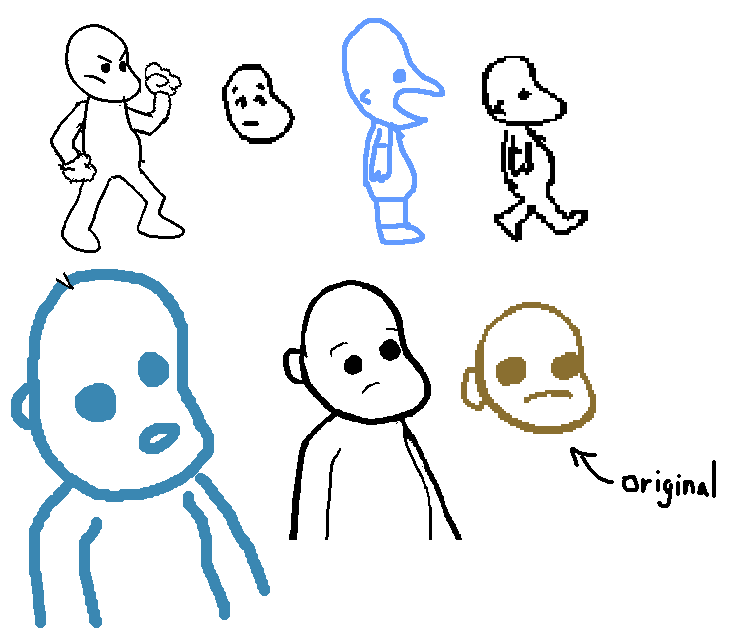

Spritesheet desenvolvida para a Sprint 1. Personagem não tinha cores definidas:
<br>


### 3.2.2. Non-Playable Characters (NPC)

O Hacker Anônimo: Um criminoso cibernético que arquitetou o ataque na escola Bitshine. Seu principal objetivo é obter lucros substanciais por meio da venda de dados roubados, comprometendo a privacidade e a segurança das vítimas no processo.
<br>
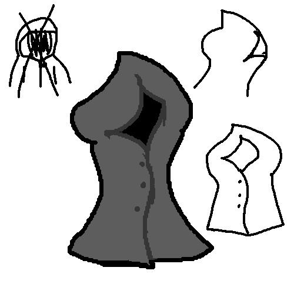


Faxineiro: Primeiro personagem que o protagonista vai interagir no jogo. Dará informações sobre o conflito e ensinará o protagonista sobre conceitos básicos das leis LGPD.
<br>
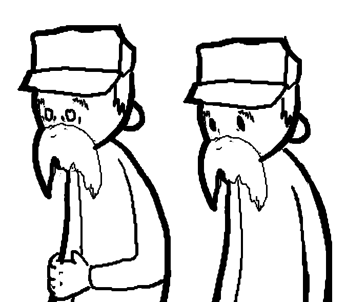


Professora Rôbo: Segundo NPC da primeira fase do jogo. Ela será outra fonte de informações sobre conceitos básicos das leis LGPD.
<br>


(Terão outros personagens coadjuvantes que são aunos e professores da escola, mas esses não foram definidos ainda)

### 3.2.3. Diversidade e Representatividade dos Personagens

Alinhamento com o público-alvo: Quando o cenário e o enredo do jogo foram concebidos, pensamos em um mundo ficcional que tem uma sociedade tecnologicamente mais avançada e que pode englobar qualquer cultura. O ambiente escolar da escola Bitshine tem uma arquitetura futurista que aborda a Lei Geral de Proteção de Dados (LGPD), que é uma matéria essencial para estudantes que crescem nesse mundo mais digital. Assim, o mundo do jogo é um pouco desconectado da realidade do Brasil, mas todos os personagens enfrentam desafios comuns, como atrasos e desatenção nas aulas, o que facilita a identificação do público jovem com eles.

Diversidade dentro da realidade do Brasil e impacto esperado: Os estudantes da escola Bitshine são um reflexo da diversidade presente na realidade do Brasil, com personagens que representam diferentes etnias e gêneros. O jogo, em seu estado atual, oferece aos jogadores a possibilidade de escolher entre seis personagens distintos e nomeá-lo da maneira que quiserem, permitindo que se identifiquem com aquele que mais se aproxima de sua própria realidade. Quanto ao estilo visual dos personagens, há um elemento de humor na criação dos personagens porque o estilo escolhido se aproxima daquele de um desenho animado, tanto para a aparência quanto para as roupas. As escolhas feitas na criação dos personagens foram feitas com o intuito de respeitar a diversidade do Brasil, já que uma pesquisa foi feita sobre os grupos étnicos mais presentes no país. Pensando em um MVP e na nossa capacidade de produzir assets, pegamos 3 dos grupos mais presentes, que são os brancos, negros e amarelos. O impacto esperado é reforçar a importância da inclusão tanto na educação quanto no setor da tecnologia.

## 3.3. Mundo do jogo (sprints 2 e 3)

### 3.3.1. Locações Principais e/ou Mapas (sprints 2 e 3)

O cenário do jogo se passa na escola Bitshine, que foi invadida e hackeada por um criminoso digital. A narrativa se desenrola ao longo de 3 andares diferentes da escola, cada um representando uma fase única. Conforme os jogadores avançam, eles exploram diferentes ambientes como salas de aula trancadas, corredores bloqueados por segurança digital e outras áreas dentro do prédio.

<br>
Fotos da escola Bitshine por fora:
<p>
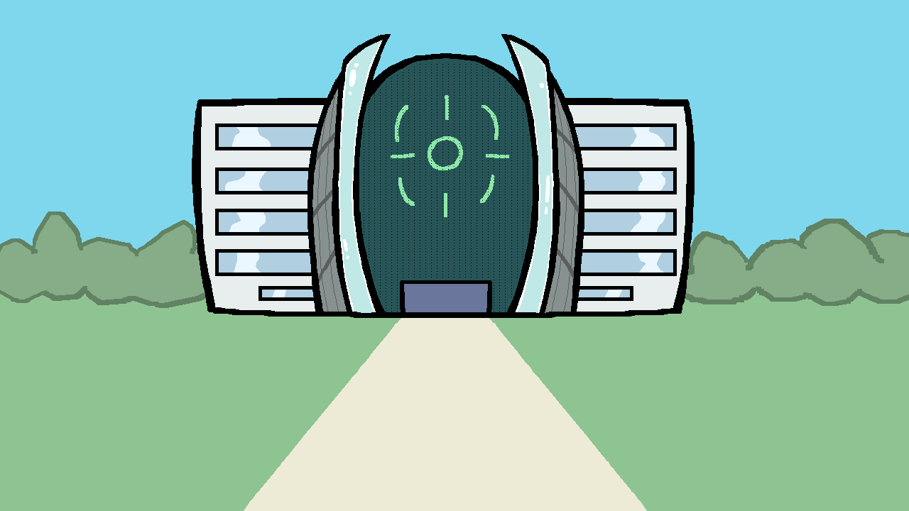

<p>

<br>
Mapa da primeira fase do jogo, situado no primeiro andar da escola:
<p>
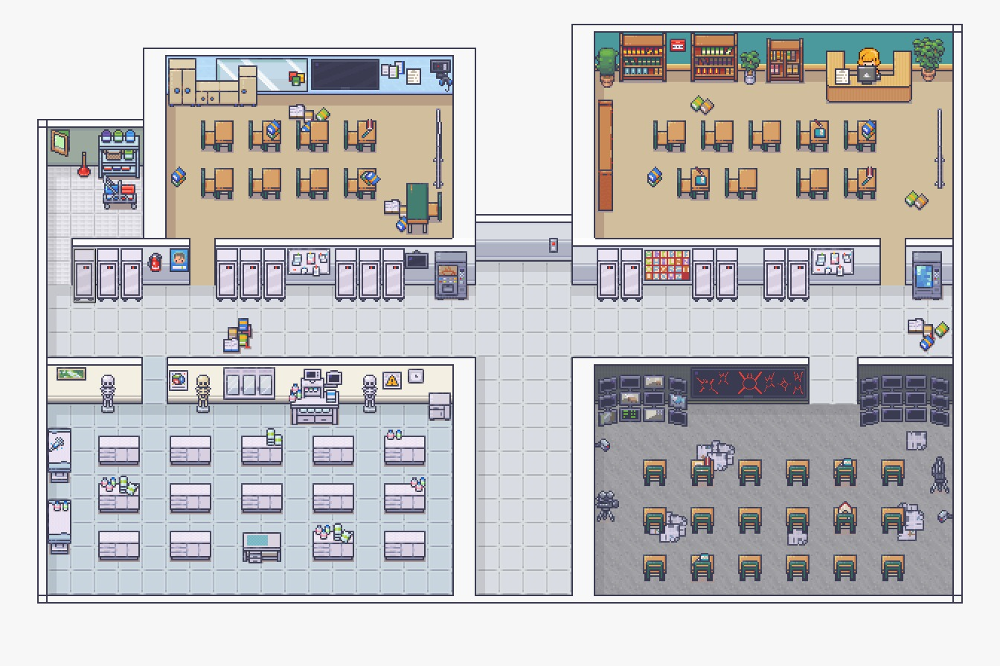
<p>

<br>
Mapa da segunda fase do jogo, um labirinto situado no segundo andar, onde fica a biblioteca da escola:
<p>
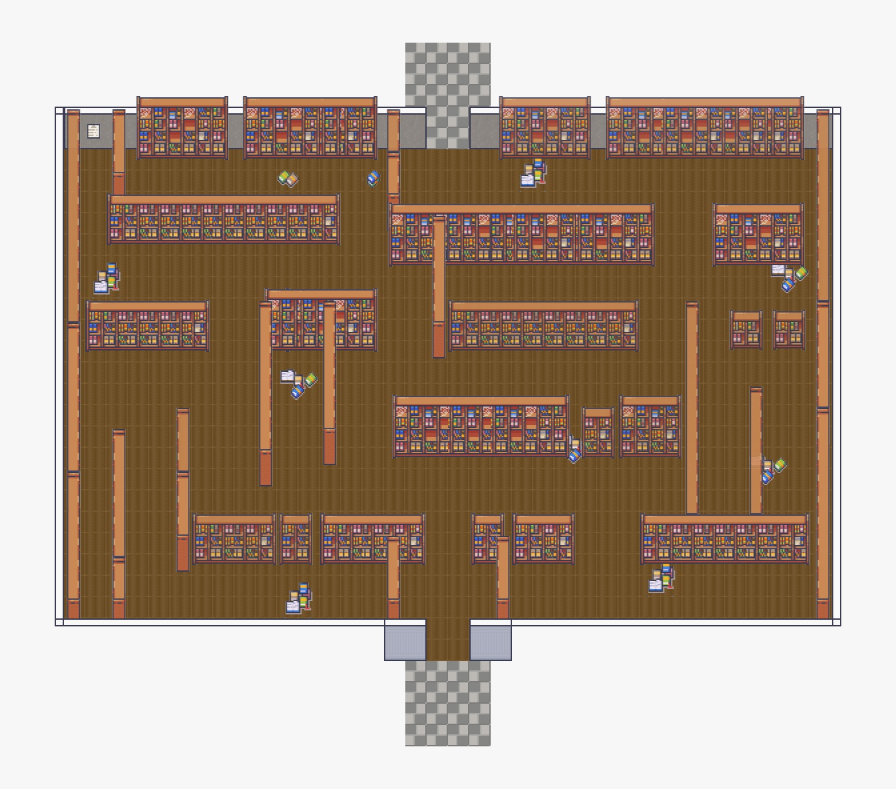
<p>


### 3.3.2. Navegação pelo mundo (sprints 2 e 3)

- As 3 fases do jogo vão se passar nos 3 andares diferentes da escola.
- O protagonista explorará cada andar, entrando em salas diferentes tentando encontrar objetos colecionáveis que ajudarão na progressão de cada fase.
- Cada andar terá um item colecionável, como pedaços de um key-card, e a coleção desses itens é essencial para a progressão no jogo.
- Uma fase se encerra quando o protagonista encontrar um item chave contido no andar atual e voltar para o elevador.
- Assim, o acesso para o próximo andar é liberado e a próxima fase é desbloqueada.

### 3.3.3. Condições climáticas e temporais (sprints 2 e 3)

Embora a história do jogo se desenrole ao longo de um único dia escolar, com eventos acontecendo durante as aulas e interações entre os personagens, não haverá limite de tempo para a conclusão das fases. O objetivo é permitir que o jogador explore cada área da escola, resolva puzzles e interaja com os personagens sem pressões externas relacionadas ao tempo. Isso visa garantir uma experiência mais estratégica e imersiva, focada na resolução de problemas e tomada de decisões.

Além disso, o jogo não incluirá variações climáticas, já que a narrativa ocorre inteiramente dentro da escola Bitshine, que está isolada do ambiente externo devido à invasão hacker. Consequentemente, o clima externo e os ciclos temporais, como mudanças de dia para noite, não serão aplicados ou influenciarão o andamento da história ou das fases. A principal ênfase estará na progressão do enredo, nos desafios internos da escola e na interação com o ambiente hackeado.

### 3.3.4. Concept Art (sprint 2)
<br>
<p align="center">
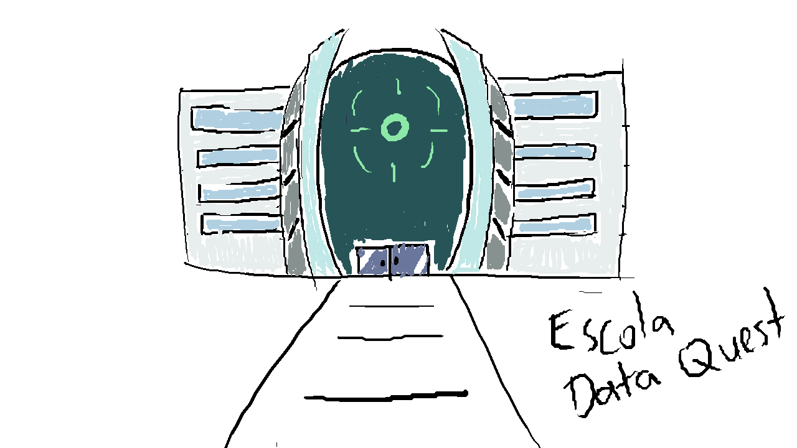
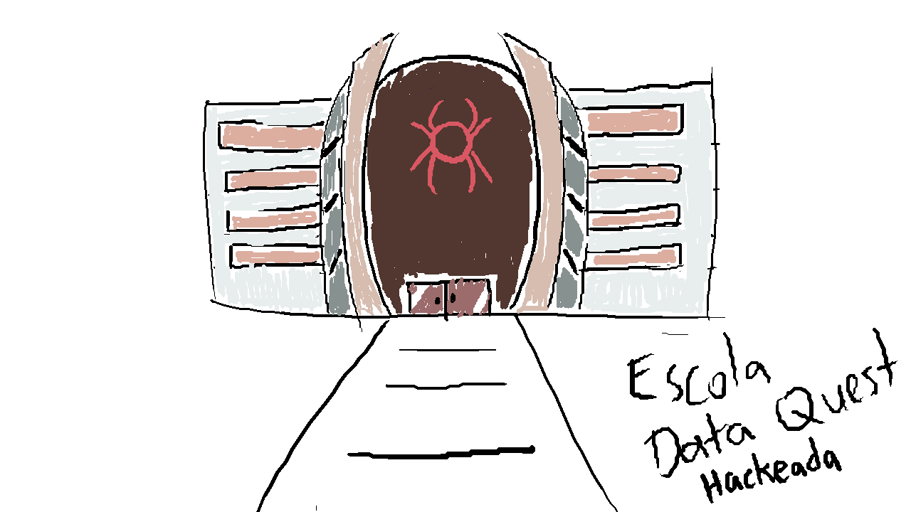
<p>

Figuras 1 e 2: Conceitos iniciais da aparência externa da escola Bitshine. Figura 1 representa a escola em seu estado de normalidade e a Figura 2 representa a escola hackeada.

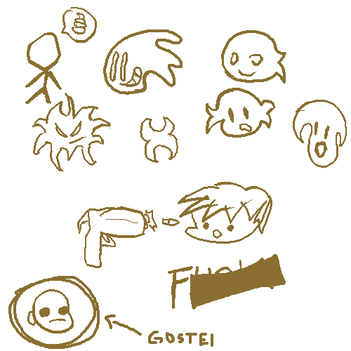

Figura 3: Conceitos iniciais do protagonista, que o jogador poderá nomear.

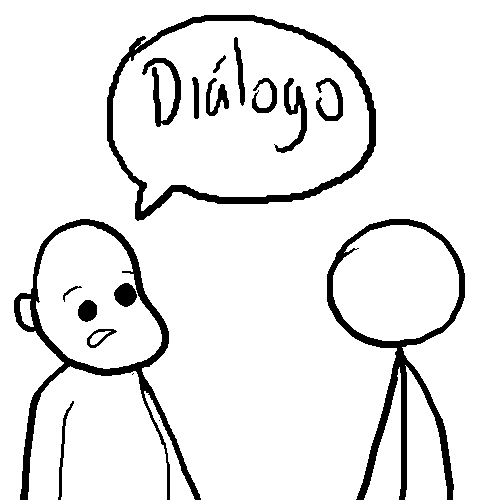

Figura 4: Conceito inicial do estilo visual do diálogo do jogo.


Figura 5: Conceitos de ataques feitos pelos inimigos robôs.


Figura 6: Ilustração do inimigo robô com suas cores definidas.

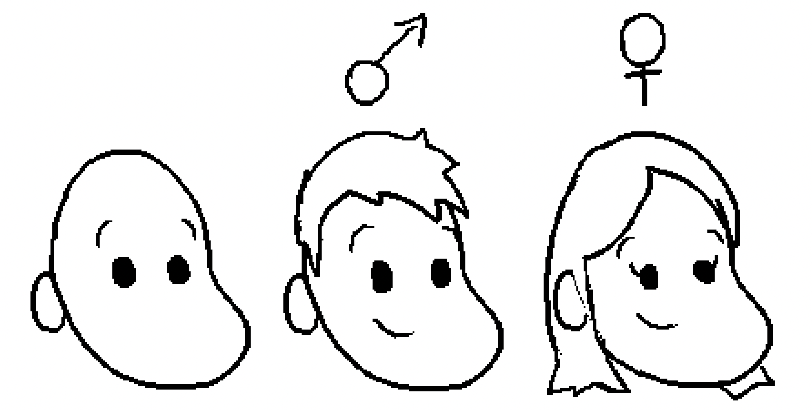

Figura 7: Primeira concept da aprimoração do protagonista.


Figura 8: Esboços dos designs aprimorados do protagonista.


### 3.3.5. Trilha sonora (sprint 4)

*Descreva a trilha sonora do jogo, indicando quais músicas serão utilizadas no mundo e nas fases. Utilize listas ou tabelas para organizar esta seção. Caso utilize material de terceiros em licença Creative Commons, não deixe de citar os autores/fontes.*

*Exemplo de tabela*
\# | Título | Ocorrência | Autoria
--- | --- | --- | ---
1 | Tema de abertura | Tela de início. | Própria
2 | Fase 1 | Uma trilha sonora que constrói um clima de mistério ao começar a fase 1. | Própria
3 | Diálogos | Efeito sonoro de diálogo ao iniciar algum diálogo. | Própria
4 | Portas | Som de porta abrindo quando o jogador abrir uma porta. | Própria
5 | Coleta de itens | Som de coleta de item ao pegar algum colecionável. | Própria
6 | Fase 2 | Uma trilha sonora para criar um clima de suspense no jogador enquanto ele explora o labirinto da fase 2 desviando dos robôs, com um piano e sintetizador. A música alterna entre momentos calmos e de tensão para manter o jogador em alerta. | Própria
7 | Botão menu | Som de clique ao apertar algum botão. | Própria
8 | Andar | Som de passos ao mover o personagem. | Própria

## 3.4. Inventário e Bestiário (sprint 3)

### 3.4.1. Inventário

\# | item |  | como obter | função | efeito sonoro
--- | --- | --- | --- | --- | ---
1 | Cartão de Identificação (KeyCard) |  | Você o obtém após ajudar cada professor-robô a recuperar o controle de sua consciência. | Com o acúmulo de quatro deles, dá acesso a áreas restritas dentro da escola e permite o acesso à ultima sala da fase 1 | Som de leitura de cartão
2 | Chave |  | Ela fica disponível na última sala da fase 1 após todos os 4 keycards serem coletados. | É utilizada para entrar no elevador para acessar a fase 2 | Som de chave
3 | ... 

### 3.4.2. Bestiário

\# | Inimigo |  | Ocorrências | Função | Impacto | Efeito Sonoro
--- | --- | --- | --- | --- | --- | ---
1 | Professora-robô |  | A partir da fase 1 | Aparece e bloqueia o caminho do jogador, soltando ameaças sobre vazar dados da escola. Após alguns segundos de diálogo, o jogador recebe um questionário sobre a LGPD para "desbloqueá-la" e restaurar seu sistema para que ela volte ao normal. | Se o jogador acerta todas as perguntas, a professora volta ao normal e o jogador aprende mais sobre a LGPD; se o jogador erra, ele precisa refazer até acertar. | Sons de sistema corrompido (bipes, estática, glitch)
2 | Robôs |  | A partir da fase 2 | Sob controle do hacker, os robôs vigiam a escola, andando de um lado para o outro | Caso o jogador encoste no robô, ele deverá responder uma questão sobre a LGPD. Se acertar, poderá continuar de onde parou; se errar, terá que voltar ao início da fase 2. | Sons de sistema corrompido (bipes, estática, glitch)

## 3.5. Gameflow (Diagrama de cenas) (sprint 2)

<div align="center">
  <sub>Diagrama de cenas</sub><br>
  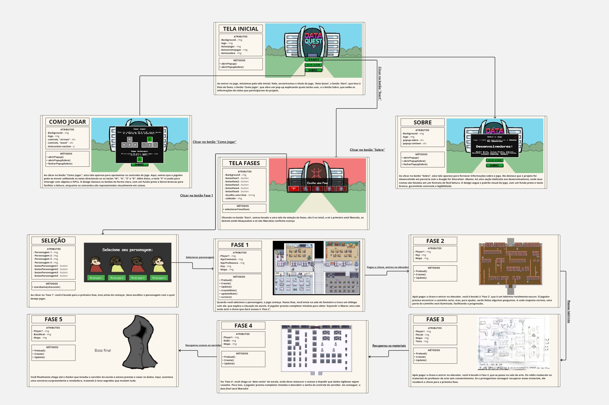<br>
</div>

## 3.6. Regras do jogo (sprint 3)

#### Objetivo geral do jogo:
 - O jogador precisa superar cada fase completando as tarefas específicas para progredir na história. Seu objetivo final é libertar a escola da invasão hacker.

#### Regras gerais do jogo:
 - O jogador precisa concluir os minigames de uma fase para ganhar itens colecionáveis que lhe darão acesso à fase seguinte.
 - Caso o jogador fracasse ao concluir um minigame, ele terá a chance de fazê-lo novamente até acertar.
 - O jogo só vai ser finalizado caso todas as fases e objetivos sejam concluídos.
 - No decorrer das fases o jogador terá contato com novos conceitos e conhecimentos sobre a LGPD.

#### Regras da **Fase 1**:
 - O jogador deverá interagir com os professores e conquistar desafios na forma de minigames com base nos conhecimentos adquiridos anteriormente ao interagir com o faxineiro no início da fase. Para cada minigame concluído, ele receberá uma parte de um key-card.
 - Ao coletar quatro partes, uma sala especial será desbloqueada, onde encontrará uma chave. Essa chave será utilizada para desbloquear o elevador que dá acesso à próxima fase.
 - O jogador só conseguirá uma parte de keycard caso ele conclua um minigame, respeitando as regras de cada um. Por exemplo, se o jogador acertar a maioria das perguntas em um quiz, ganhará uma parte de keycard.
 - Para acessar a próxima fase, o jogador deve se aproximar da chave e após isso ir até o elevador, onde a transição entre fases ocorrerá automaticamente.

## 3.7. Mecânicas do jogo (sprint 3)

#### Teclas de movimentação: **W A S D** ou **Setas do Teclado**:
 - **W** ou **Seta para cima**: Movimentação para cima
 - **S** ou **Seta para baixo**: Movimentação para baixo
 - **A** ou **Seta para esquerda**: Movimentação para esquerda
 - **D** ou **Seta para direita**: Movimentação para direita.

#### Tecla de interação com o cenário (portas e objetos): **"Espaço"**: 
 - Usar a tecla **"Espaço"** para abrir portas, coletar itens e para demais interações com o cenário.
 - Na primeira fase você deverá user a tecla "espaço" para abrir a porta da sala de faxina após ter falado com o faxineiro, para poder ter acesso ao restante do mapa.

#### Tecla de interação com NPCs: **"E"**:
 - Use a tecla **"E"** para interagir com os NPCs.
 - Na primeira fase você poderá interagir com o NPC do faxineiro, que dará um contexto geral da situação da fase ao personagem e com os NPCs dos professores robôs, que precisarão ter seus sistemas reiniciados através de um minigame de perguntas e respostas. 

#### Botão de "Missões":
 - Durante todas as fases, o jogador terá acesso a um botão "Missões", localizado no canto superior direito da tela. Ao clicar nele, poderá visualizar os objetivos específicos da fase atual, garantindo que saiba quais tarefas precisa concluir para avançar no jogo. Isso ajudará na organização das ações e no acompanhamento do progresso rumo à libertação da escola da invasão hacker.

#### Mecânicas da primeira fase:
 - O jogador deve interagir com o NPC do faxineiro para entender o contexto da fase.
 - Após a interação, deverá abrir a porta da sala (pressionando "Espaço") e acessar o restante do mapa, onde encontrará os NPCs dos professores robôs.
 - Ao encontrar os professores, o jogador deverá interagir com eles (pressionando "E") e participar de um minigame, que pode variar entre um perguntas e respostas ou um que é jogo da forca, para que o professor possa "reiniciar seus sistemas". Caso o minigame seja feito com sucesso, o jogador ganhará 1 pedaço de um keycard.
 - O jogador deverá ajudar os 4 professores para ganhar o total de 4 pedaços de um keycard, para que ele possa acessar uma sala que vai conter uma chave.
 - Ao acessar a sala com a chave, o jogador deve se aproximar dela para coletá-la e depois andar em direção ao elevador, que lhe dará acesso à fase 2.


## 3.8. Implementação Matemática de Animação/Movimento (sprint 4)

Para a aplicação da lógica matematica no nosso jogo, nós desenvolvemos uma animação para instruir oque o jogador deve fazer para concluir o minigame final da fase 2, que consiste em lançar 4 chaves em cadeados espalhados pela tela.

<div align="center">
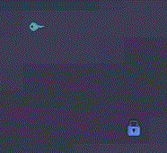
</div>

Durante o desenvolvimento do código, testamos vários valores diferentes até que chegássemos em uma interface do tutorial que tenha a capacidade de ensinar como serão as regras do próximo minigame que o jogador deve jogar.

### Definição final dos valores de entrada e construção do código baseado nas fórmulas:

<div align="center">
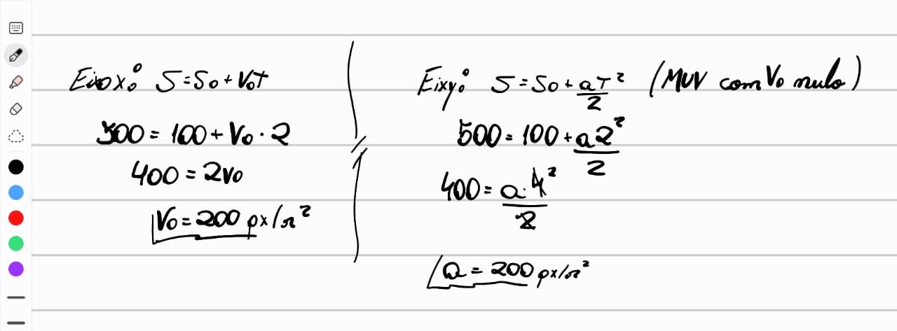
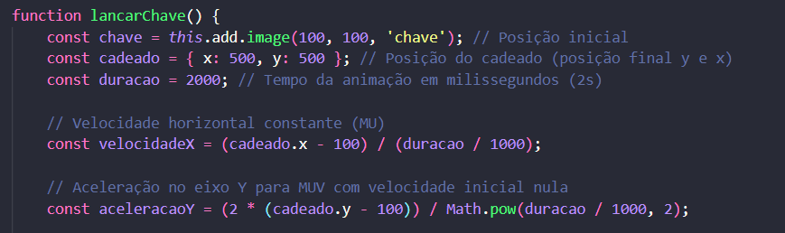
</div>

Como mostrado nas imagens, para o eixo X, seguimos a fórmula de movimento uniforme para demonstramos a velocidade inicial (constante), já para o eixo Y, como queríamos simular uma gravidade atuando no projétil, utilizamos a fórmula do Movimento Uniformemente Variado com velocidade inicial nula para acharmos a aceleração de 200px/s².

### Atualização das posições, velocidades e aceleração são geradas a cada frame carregado:

<div align="center">
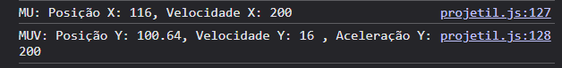 (frame 5 da animação)
</div>

O diretório do arquivo pode ser acessado em: /src/fase2
/projetiltutorial.js

# <a name="c4"></a>4. Desenvolvimento do Jogo

## 4.1. Desenvolvimento preliminar do jogo (sprint 1)

A primeira versão do jogo foi desenvolvida com foco na implementação das mecânicas essenciais, garantindo que a estrutura básica estivesse funcional. Durante essa fase inicial, trabalhamos na movimentação do personagem, na interação com NPCs, no sistema de combate baseado em perguntas e respostas sobre a Lei Geral de Proteção de Dados (LGPD) e na estruturação da primeira fase dentro do cenário escolar.

Em termos de código, foi implementado um sistema de movimentação utilizando as teclas WASD, permitindo que o jogador navegue pelo ambiente do jogo de forma fluida. Além disso, foi criada a mecânica de interação com personagens não jogáveis (NPCs), possibilitando diálogos que fornecem informações e desafios ao jogador. O combate foi desenvolvido com um modelo inovador de perguntas e respostas, no qual o progresso depende do conhecimento do jogador sobre LGPD. Caso acerte as respostas, o jogador avança; caso contrário, perde pontos ou enfrenta consequências dentro do jogo.

A estrutura das fases foi pensada para representar os três andares de uma escola, onde cada fase corresponde a um andar. Isso cria uma progressão lógica e imersiva, incentivando o jogador a explorar novos desafios conforme avança. Essa abordagem contribui para a ambientação e narrativa do jogo, tornando a experiência mais envolvente.

### Ilustrações e Prints de Tela
<p align="center">
  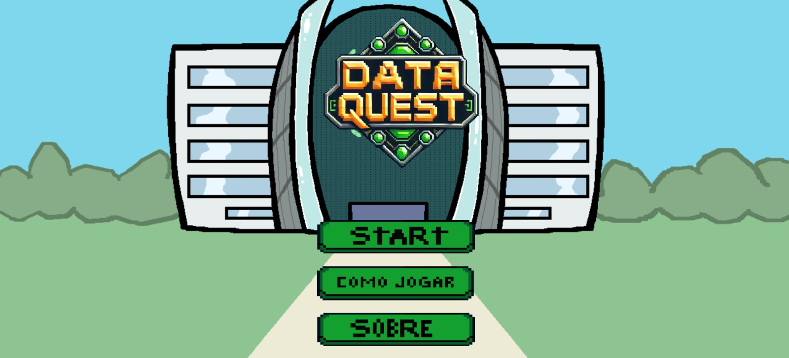
  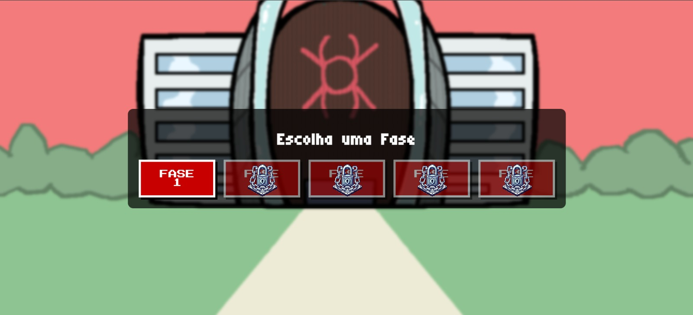
  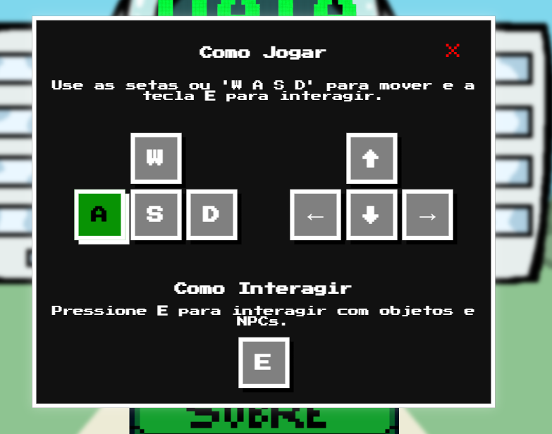
  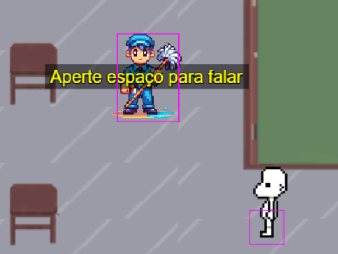
  
</p>

### Dificuldades Encontradas
Durante o desenvolvimento, algumas dificuldades foram identificadas. A implementação do sistema de diálogos exigiu ajustes para garantir que os textos fossem exibidos corretamente e fluíssem de maneira natural. No sistema de combate, um dos desafios foi equilibrar a dificuldade das perguntas para que o jogo permanecesse desafiador sem ser frustrante. Além disso, alguns problemas técnicos surgiram na movimentação do personagem, como colisões inesperadas e ajustes na resposta do teclado.

Outra questão foi o design das fases. Criar um ambiente escolar que fosse visualmente interessante e intuitivo para navegação exigiu várias iterações. Ainda estamos aprimorando a disposição dos elementos no cenário para tornar a progressão mais clara ao jogador.

Os próximos passos incluem a melhoria do sistema de combate, tornando as perguntas mais dinâmicas, a expansão dos diálogos com NPCs para enriquecer a interação, o refinamento dos cenários e fases para uma progressão mais intuitiva, além da correção de bugs e otimização do código. Também planejamos adicionar trilha sonora e efeitos visuais para aumentar a imersão do jogador.

## 4.2. Desenvolvimento básico do jogo (sprint 2)

Durante o sprint 2, focamos em aprimorar o personagem principal e introduzir novos personagens, o que enriqueceu a narrativa e a jogabilidade do jogo. Os novos personagens foram integrados de forma a complementar a história, trazendo diversidade e ampliando as possibilidades de interação.
Além disso, criamos e implementamos diálogos entre os personagens. Essa funcionalidade foi essencial para tornar a experiência do jogador mais imersiva, permitindo o desenvolvimento da trama de forma mais dinâmica. A implementação envolveu a construção de um sistema básico de diálogos, com ramificações que afetam o progresso do jogador.
Outro ponto importante deste sprint foi o aprimoramento e a conclusão da fase 01. Foram feitos ajustes no design do cenário, correção de bugs e otimização da mecânica de jogo, garantindo uma experiência fluida e envolvente para o jogador.

Dificuldades Encontradas:

- Ajuste preciso da sincronização dos diálogos com as ações dos personagens.
- Problemas de desempenho ao adicionar novos personagens, exigindo otimização do código.
- Balanceamento da dificuldade da fase 01 para manter o jogo desafiador, mas acessível.

Próximos Passos:
- Implementação da fase 02, com novos desafios e ambientes.
- Melhoria no sistema de diálogos, incluindo opções de resposta mais complexas.
- Testes de jogabilidade para refinar a experiência do usuário.

Ilustrações do Desenvolvimento:
<br>
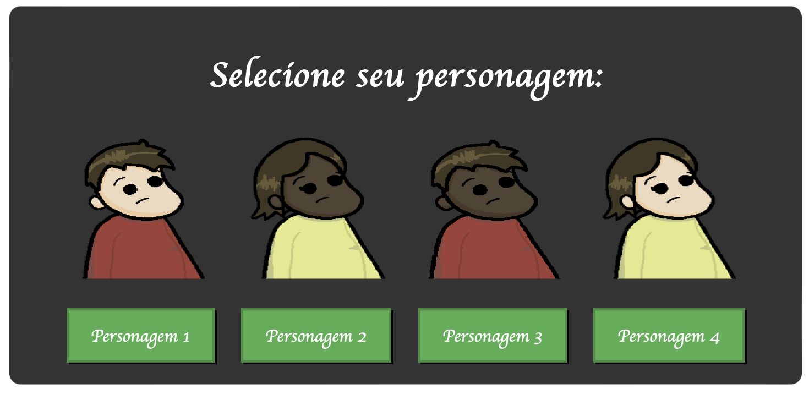
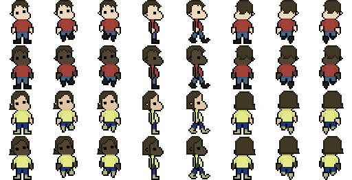
<br>
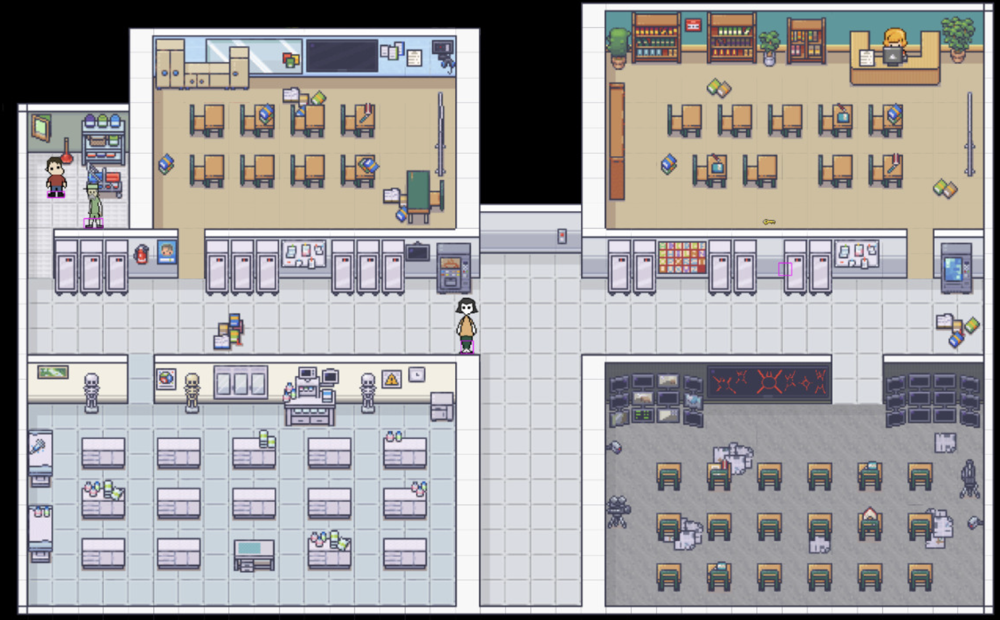
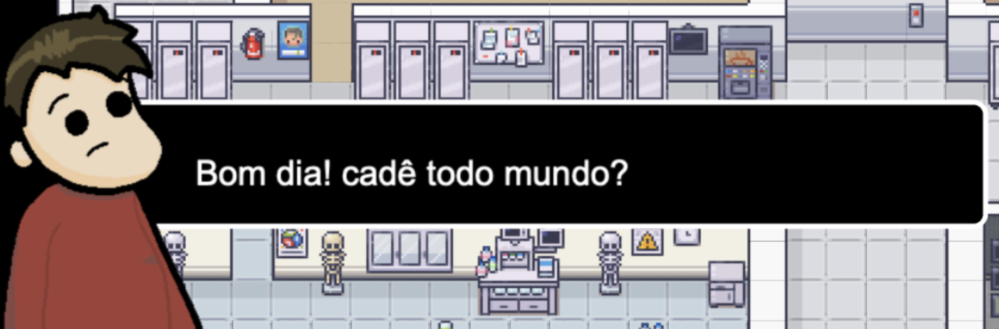

## 4.3. Desenvolvimento intermediário do jogo (sprint 3)

Em termos de código, os principais pontos do desenvolvimento foram:

### Minigames

O jogo já conta com quatro minigames na fase 1. Buscamos utilizar jogos clássicos para que a jogabilidade fosse mais intuitiva. Os quatro minigames são:

1. Perguntas sobre conceitos gerais da LGPD – Um quiz no qual o jogador deve responder corretamente para avançar.

2. Jogo da forca com termos da LGPD – O jogador precisa adivinhar palavras relacionadas à Lei Geral de Proteção de Dados.

3. Jogo da memória – O jogador deve relacionar pares de cartas, onde uma contém um termo e a outra seu respectivo conceito.

4. Jogo de classificação de conteúdo – O jogador deve classificar informações como "dado pessoal" ou "dado sensível", conforme os conceitos da LGPD.

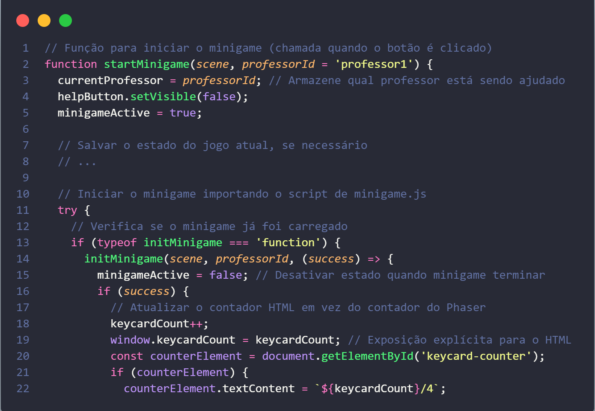
Código de implementação dos mini games:

```javascript
 function startMinigame(scene, professorId = 'professor1') {
    currentProfessor = professorId; // Armazene qual professor está sendo ajudado
    helpButton.setVisible(false);
    minigameActive = true;
    
    // Verificar se já tentamos carregar anteriormente
    if (window.minigameLoadAttempted && !window.initMinigame) {
      console.error("Falha ao carregar o minigame após tentativa anterior");
      helpButton.setVisible(true);
      minigameActive = false;
      return;
    }
```

```javascript
  helpButton.removeListener('pointerdown');
        helpButton.on('pointerdown', () => {
          console.log("Iniciando minigame do Professor 1");
          startMinigame(scene, 'professor1');
        });
        
```

### Diálogos dos npcs

Na construção dos diálogo:

```javascript
// Verifica proximidade com o faxineiro
    if (distanceToNpc1 < 70 && !dialogoNpc1Concluido) {
      podeIniciarDialogo = true;
      if (!dialogoIniciado) {
        avisoTexto.setPosition(npc1.x, npc1.y - 10);
        avisoTexto.setVisible(true);
      }
    } 
    // Verifica proximidade com o professor
    else if (distanceToProfessor < 70 && !dialogoProfessorConcluido) {
      podeIniciarDialogo = true;
      if (!dialogoProfessorIniciado) {
        avisoTexto.setPosition(professorNpc.x, professorNpc.y - 10);
        avisoTexto.setVisible(true);
      }
    }
    // Verifica proximidade com o professor2
    else if (distanceToProfessor2 < 70 && !dialogoProfessor2Concluido) {
      podeIniciarDialogo = true;
      if (!dialogoProfessor2Iniciado) {
        avisoTexto.setPosition(professorNpc2.x, professorNpc2.y - 10);
        avisoTexto.setVisible(true);
      }
    }
    // Verifica proximidade com o professor3
    else if (distanceToProfessor3 < 70 && !dialogoProfessor3Concluido) {
      podeIniciarDialogo = true;
      if (!dialogoProfessor3Iniciado) {
        avisoTexto.setPosition(professorNpc3.x, professorNpc3.y - 10);
        avisoTexto.setVisible(true);
      }
    }
    // Verifica proximidade com o professor4
    else if (distanceToProfessor4 < 70 && !dialogoProfessor4Concluido) {
      podeIniciarDialogo = true;
      if (!dialogoProfessor4Iniciado) {
        avisoTexto.setPosition(professorNpc4.x, professorNpc4.y - 10);
        avisoTexto.setVisible(true);
      }
    }
    else {
      podeIniciarDialogo = false;
      if (!dialogoIniciado && !dialogoProfessorIniciado && !dialogoProfessor2Iniciado && !dialogoProfessor3Iniciado && !dialogoProfessor4Iniciado) {
        avisoTexto.setVisible(false);
      }
    }
    
```


código de texto dos diálogos com o faxineiro:

```javascript
 const dialogosPersonalizados = [
        { texto: "Com licença senhor, o que aconteceu por aqui?...", autor: "player" },
        { texto: "Por que a porta da escola está fechada?", autor: "player" },
        { texto: "Fale mais baixo! Senão eles poderão te detectar!", autor: "npc" },
        { texto: "Quem são eles?", autor: "player" },
        { texto: "Tem muita informação para explicar. É melhor você ir embora,", autor: "npc" },
        { texto: "As coisas estão muito perigosas aqui dentro.", autor: "npc" },
        { texto: "Não, eu quero saber o que aconteceu.", autor: "player" },
        { texto: "(Jovem persistente…) Ok, tudo bem...", autor: "npc" },
        { texto: "Mas eu só consigo te explicar o que eu sei.", autor: "npc" },
        { texto: "Tudo bem.", autor: "player" },
        { texto: "Eu estava limpando as janelas perto da entrada...", autor: "npc" },
        { texto: "e percebi que a escola começou a ser invadida.", autor: "npc" },
        { texto: "Aparentemente alguém conseguiu acessar o sistema...", autor: "npc" },
        { texto: "para controlar todos os professores da escola...", autor: "npc" },
        { texto: "E ROUBAR DADOS DOS ALUNOS.", autor: "npc" },
        { texto: "PERA…!!!", autor: "player" },
        { texto: "UM HACKER CONTROLANDO OS PROFESSORES PARA ROUBAR DADOS PESSOAIS??", autor: "player" },
        { texto: "…", autor: "npc" },
        { texto: "Você não sabe o que é isso né?", autor: "npc" },
        { texto: "Eheh…, eu nunca prestei muita atenção nessas aulas.", autor: "player" },
        { texto: "Agora mais do que nunca os conteúdos daquelas aulas importam!!", autor: "npc" },
        { texto: "Os seus dados pessoais são as informações...", autor: "npc" },
        { texto: "que permitem identificar você. ", autor: "npc" },
        { texto: "Informações como seu nome, seu RG e o seu CPF.", autor: "npc" },
        { texto: "Ah... então tipo, meu nome completo e essas coisas?", autor: "player" },
        { texto: "Exatamente! Mas não é só isso.", autor: "npc" },
        { texto: "Seu endereço, seu telefone, até seu histórico escolar...", autor: "npc" },
        { texto: "tudo isso são dados pessoais.", autor: "npc" },
        { texto: "E essas informações, se caírem nas mãos erradas,", autor: "npc" },
        { texto: "podem ser um grande problema.", autor: "npc" },
        { texto: "Tá, mas por que alguém ia querer roubar essas informações?", autor: "player" },
        { texto: "Olha, esses hackers podem vender...", autor: "npc" },
        { texto: "essas informações ou usá-las para golpes.", autor: "npc" },
        { texto: "Se alguém souber seus dados,", autor: "npc" },
        { texto: "pode tentar criar contas no seu nome ou coisas piores.", autor: "npc" },
        { texto: "Eita, sério mesmo?", autor: "player" },
        { texto: "Muito sério!", autor: "npc" },
        { texto: "E por isso existe a LGPD—Lei Geral de Proteção de Dados.", autor: "npc" },
        { texto: "Ela serve para proteger as informações pessoais...", autor: "npc" },
        { texto: "das pessoas e garantir que ninguém as use sem permissão.", autor: "npc" },
        { texto: "Ah... acho que já ouvi esse nome em algum lugar,", autor: "player" },
        { texto: "mas nunca tive tanto interesse.", autor: "player" },
        { texto: "Pois é bom saber disso agora,", autor: "npc" },
        { texto: "porque você não tem escolha.", autor: "npc" },
        { texto: "Se quiser ajudar a salvar os alunos,", autor: "npc" },
        { texto: "vai ter que aprender pelo menos o básico sobre isso.", autor: "npc" },
        { texto: " Deve ter algum jeito de tirar os professores do controle do hacker, ", autor: "player" },
        { texto: "eu sei algumas coisas sobre a IA deles.", autor: "player" },
        { texto: "Certo, então tente recuperar o acesso!", autor: "npc" },
      ];
```

### HUD

Na construção da Hud do jogo buscamos um design simples e eficaz.

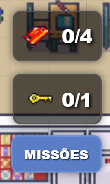 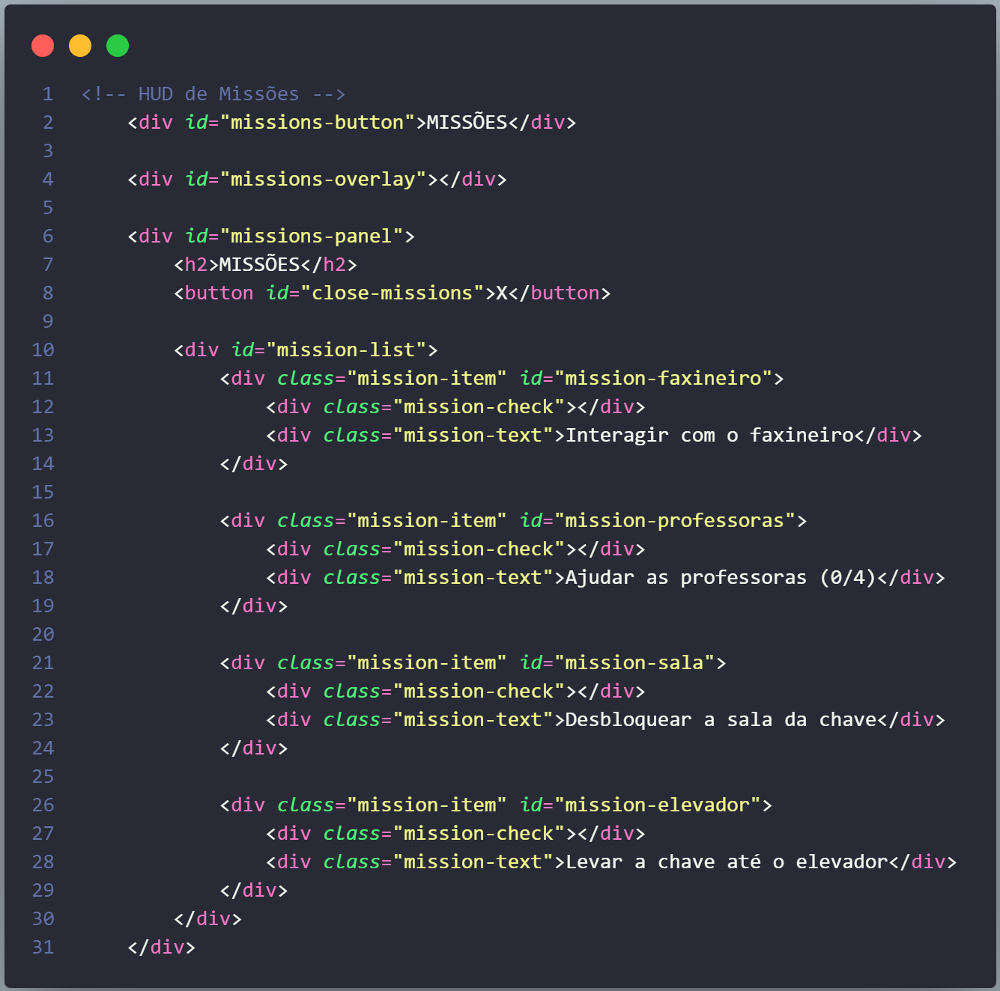

Código da implementação da Hud de missões:

```javascript
 // Configurar o sistema de missões
  function setupMissionsSystem() {
    const missionsButton = document.getElementById('missions-button');
    const missionsPanel = document.getElementById('missions-panel');
    const missionsOverlay = document.getElementById('missions-overlay');
    const closeButton = document.getElementById('close-missions');
    
    if (!missionsButton || !missionsPanel || !missionsOverlay || !closeButton) {
      console.error("Mission system elements not found in DOM");
      return;
    }
    
    console.log("Setting up missions system with elements:", {
      button: missionsButton,
      panel: missionsPanel,
      overlay: missionsOverlay,
      closeBtn: closeButton
    });
    
    // Remove any existing listeners to prevent duplicates
    missionsButton.removeEventListener('click', showMissionsPanel);
    closeButton.removeEventListener('click', hideMissionsPanel);
    missionsOverlay.removeEventListener('click', hideMissionsPanel);
    
    // Add fresh listeners
    missionsButton.addEventListener('click', showMissionsPanel);
    closeButton.addEventListener('click', hideMissionsPanel);
    missionsOverlay.addEventListener('click', hideMissionsPanel);
    
    // Define the functions for showing/hiding the panel
    function showMissionsPanel() {
      console.log("Mission button clicked, showing panel");
      
      // Apply inline styles to ensure visibility
      missionsPanel.style.display = 'block';
      missionsPanel.style.opacity = '1';
      missionsOverlay.style.display = 'block';
      missionsOverlay.style.opacity = '1';
      
      // Force redraw (sometimes needed for display changes to take effect)
      missionsPanel.offsetHeight;
      
      // Add visible class if using CSS animations
      missionsPanel.classList.add('visible');
      missionsOverlay.classList.add('visible');
      
      // Update missions when panel opens
      if (typeof window.updateMissions === 'function') {
        window.updateMissions();
      }
    }
    
    function hideMissionsPanel() {
      console.log("Hiding missions panel");
      
      // Remove visible class first if using CSS animations
      missionsPanel.classList.remove('visible');
      missionsOverlay.classList.remove('visible');
      
      // Set display to none after a small delay (to allow animations to complete)
      setTimeout(() => {
        missionsPanel.style.display = 'none';
        missionsOverlay.style.display = 'none';
      }, 300);
    }
    
    // Ensure initial state
    missionsPanel.style.display = 'none';
    missionsOverlay.style.display = 'none';
    
    // Add debugging click handler to confirm button is responsive
    missionsButton.onclick = function() {
      console.log("Missions button clicked directly");
      showMissionsPanel();
    };
  }

  // Função para atualizar o estado das missões
  window.updateMissions = function() {
    console.log('Atualizando estado das missões:', {
      dialogoNpc1Concluido: window.dialogoNpc1Concluido,
      keycardCount: window.keycardCount,
      isDoor2Open: window.isDoor2Open,
      keyCollected: window.keyCollected
    });
    
    // Missão 1: Interagir com o faxineiro - checagem aprimorada
    const missionFaxineiro = document.getElementById('mission-faxineiro');
    if (missionFaxineiro && window.dialogoNpc1Concluido === true) {
      console.log("Marcando missão do faxineiro como completa");
      missionFaxineiro.classList.add('mission-complete');
    }
    
    // Missão 2: Ajudar as professoras (0/4)
    const keycardCount = window.keycardCount || 0;
    const professorProgress = document.getElementById('mission-professoras');
    if (professorProgress) {
      const missionTextElement = professorProgress.querySelector('.mission-text');
      if (missionTextElement) {
        missionTextElement.textContent = `Ajudar as professoras (${keycardCount}/4)`;
      }
      if (keycardCount >= 4) {
        professorProgress.classList.add('mission-complete');
      }
    }
    
    // Missão 3: Desbloquear a sala da chave
    const missionSala = document.getElementById('mission-sala');
    if (missionSala && window.isDoor2Open) {
      missionSala.classList.add('mission-complete');
    }
    
    // Missão 4: Levar a chave até o elevador
    const missionElevador = document.getElementById('mission-elevador');
    if (missionElevador && window.keyCollected) {
      missionElevador.classList.add('mission-complete');
    }
  };

  // Verificar a missão do faxineiro a cada 1 segundo como backup
  setInterval(function() {
    if (document.getElementById('game-container').style.display === 'block' && window.dialogoNpc1Concluido) {
      document.getElementById('mission-faxineiro').classList.add('mission-complete');
    }
  }, 1000);

  // Adicionar um verificador periódico para as missões como backup
  setInterval(function() {
    if (document.getElementById('game-container').style.display === 'block') {
      window.updateMissions();
    }
  }, 2000);
```

## Dificuldades e Próximos passos

Sobre o desenvolvimento do código na sprint, encontramos algumas dificuldades, tais como a implementação da animação da porta e o funcionamento de sua colisão. Outra dificuldade que tomou muito do nosso tempo, foi a organização do código em html para javascript, porém esses problemas já foram solucionados

Para a próxima sprint, até o momento, a ideia é focar no desenvolvimento de um sistema de criação de personagens para aumentar a diversidade, implementação de efeitos sonoros e músicas que se encaixam na arte do jogo, além de organização do código como um todo, já que durante o decorrer dessa sprint, percebemos que algumas linha de código não estavam fáceis de compreender. Além disso, vamos definir as mecânicas principais da fase 2, que se passa na biblioteca.

## 4.4. Desenvolvimento final do MVP (sprint 4)

Na Sprint 4, o desenvolvimento do MVP do jogo foi concluído, com a entrega das funcionalidades principais que garantem a experiência central do jogo. O objetivo principal foi criar uma versão funcional e divertida que permitisse ao jogador interagir com a temática de segurança digital, especialmente com foco na LGPD.

### Entregas do MVP
Fase 2 - Labirinto no Escuro: A segunda fase do jogo foi implementada, onde o jogador deve navegar por um labirinto sem luz, com o desafio de encontrar e pegar 4 chaves escondidas no mapa. Ao longo do caminho, o jogador encontra mini-robôs que fazem perguntas sobre a LGPD. A interação com esses robôs é uma forma de aprendizado, incentivando o jogador a refletir sobre temas importantes enquanto avança no jogo.

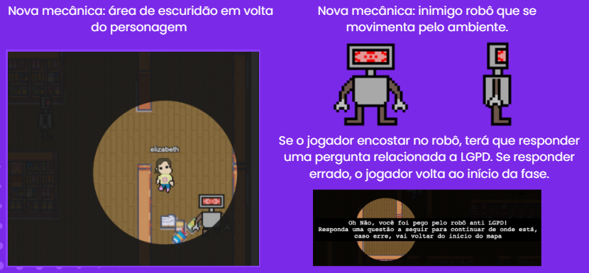

### Mini-game de Lançamento de Chave
Após pegar as 4 chaves e encontrar a saída, o jogador realiza um mini-game de lançamento de chaves com lógica matematica para desbloquear 4 cadeados e avançar para o próximo nível, que levará ao elevador que conduzirá à terceira fase.

### Dificuldades
Um dos desafios foi a implementação da mecânica do labirinto sem iluminação, que exigiu ajustes nos controles de movimento do personagem para garantir uma navegação fluida, sem prejudicar a jogabilidade. Além disso, a criação das interações com os mini-robôs exigiu um equilíbrio entre o desafio das perguntas e a fluidez do jogo.

### Plano futuro
A terceira fase está em desenvolvimento, e a melhoria na iluminação do labirinto está prevista para a próxima sprint, com foco em tornar a navegação mais intuitiva.

### Diversidade e Protagonistas
A equipe trabalhou na atualização dos personagens jogáveis, incluindo a adição de dois novos personagens e uma reformulação dos existentes, garantindo que houvesse mais opções e representatividade no jogo. Esses personagens agora possuem características únicas que ajudam o jogador a se identificar melhor com o protagonista e a história do jogo. A principal dificuldade foi garantir que os novos personagens se encaixassem na narrativa e no estilo visual do jogo, sem comprometer a coesão do ambiente e da história. Além disso, a adição de novos diálogos e personalidades exigiu mais tempo de revisão e testes para garantir que a interação com o jogador fosse natural.

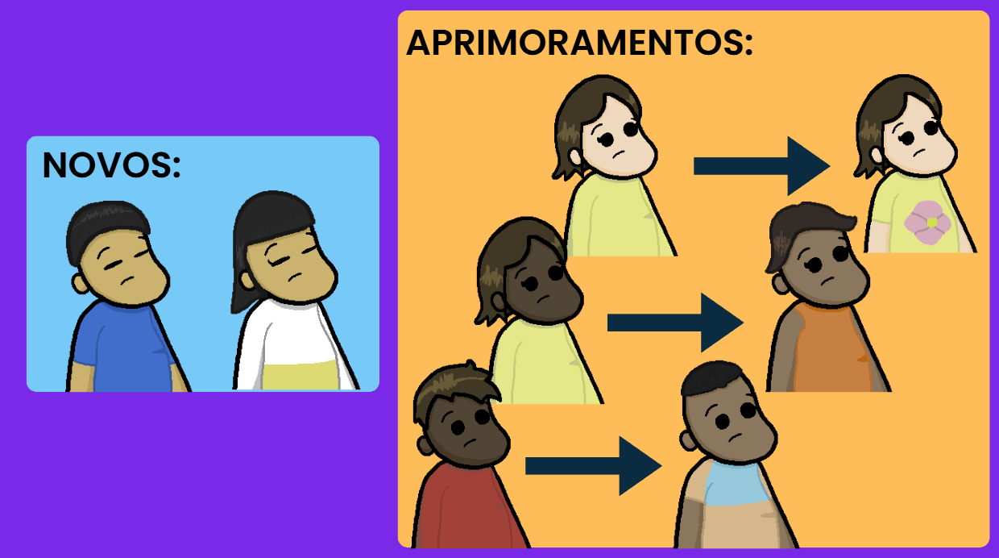

### Proposta de Valor e Canvas
O Canvas da proposta de valor foi finalizado, solidificando a missão do jogo de educar os jogadores sobre a LGPD de forma divertida, utilizando o contexto de um ambiente escolar invadido por um hacker. A proposta de valor também foi revisada para garantir que a experiência de aprendizado fosse clara e engajante. A principal dificuldade aqui foi integrar as mecânicas de jogo e a narrativa de maneira que a mensagem sobre LGPD fosse transmitida de forma eficaz, sem que isso interrompesse a diversão e a fluidez da jogabilidade.

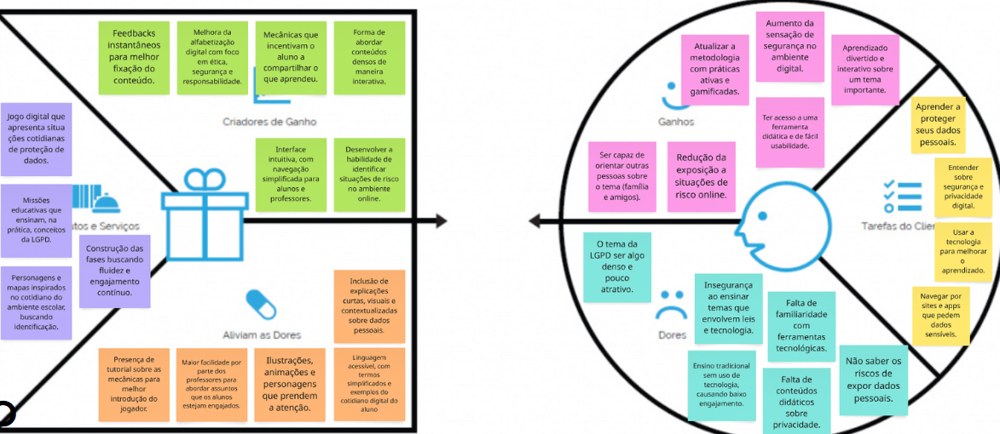

Em suma, A Sprint 4 foi crucial para finalizar o MVP do jogo. Embora tenha havido desafios técnicos relacionados à navegação no labirinto e ao equilíbrio entre as mecânicas de aprendizado e diversão, o jogo agora apresenta uma versão funcional com a maioria das interações essenciais e com um enredo que introduz o tema de segurança digital e LGPD de maneira divertida. Os planos para as próximas fases incluem o refinamento das mecânicas de jogo e a implementação da terceira fase.

## 4.5. Revisão do MVP (sprint 5)

*Descreva e ilustre aqui o desenvolvimento dos refinamentos e revisões da versão final do jogo, explicando brevemente o que foi entregue em termos de MVP. Utilize prints de tela para ilustrar.*

# <a name="c5"></a>5. Testes

## 5.1. Casos de Teste (sprints 2 a 4)

As tabelas abaixo apresentam os casos de teste comuns que podem ser executados a qualquer momento para testar o funcionamento e a integração das partes do jogo. A tabela de casos positivos vai verificar se o jogo funciona a partir de entradas válidas, enquanto a tabela de casos negativos testa se o programa funciona a partir de entradas inválidas.

## Casos de Teste Positivos

\# | Título | Pré-condição | Descrição do Teste | Pós-condição
--- | --- | --- | --- | ---
1 | Verificar a inicialização correta do jogo | O jogador deve estar posicionado na tela de abertura do jogo | Executar o jogo a partir do seu início, sem realizar nenhuma ação adicional antes da primeira interação possível | O jogo deve ser iniciado corretamente, carregando a Fase 1 como ponto inicial da experiência do usuário
2 | Verificar a interação intencional entre o personagem e um item coletável | Na primeira fase, após completar os minigames, posicionar o personagem próximo a chave coletável, localizada em uma sala de aula no canto direito superior do mapa | Movimentar o personagem para fazer a coleta do item | O item deve ser removido do cenário e o efeito de coleta deverá ser aplicado no HUD, mostrando "1/1"
3 | Validar se a transição correta entre a fase 1 e a fase 2 | Após interagir com os NPCs da professora, completar os minigames da primeira fase para depois pegar a chave que está na sala trancada, no canto direito superior do mapa | Se aproximar do elevador, no centro do mapa, com a chave que ficará flutuando ao lado do personagem | Quando houver contato entre o personagem e o elevador, o jogo deve acionar a transição e avançar para a próxima fase
4 | Testar se a inicialização correta do diálogo | Posicionar o personagem próximo a um NPC interativo, mais fácil se for o faxineiro na fase 1 | Se estiver aparecendo um texto que diz ">E<", o jogador pode iniciar diálogo com o NPC pressionando a tecla "E" | Devem ser exibidos uma caixa de diálogo com o texto do diálogo dentro e do lado da caixa um render do personagem que estiver falando. O jogador deve ter a opção de avançar a conversa usando a tecla "E"
5 | Validar se o jogo corretamente salva o progresso do jogador | Carregar um jogo salvo anteriormente | Iniciar a jogabilidade a partir do ponto salvo | O jogo deve carregar o progresso salvo corretamente, restaurando posição do personagem, itens coletados e status das fases sem falhas ou perda de dados.
6 | Teste da atualização correta da tela de missões | Tentar completar uma missão, mais fácil se for a interação com o faxineiro | Abrir a tela de missões clicando no botão "missões" no canto direito da tela | Se a missão for concluída, o texto "Interagir com o faxineiro" deve trocar de branco para verde
7 | Teste da condição de falha dos minigames da fase 1 | Interação de diálogo com o NPC da professora na fase 1 para acessar o minigame | Jogar o minigame até acabar, tentando falhar (condição de erro vai depender do minigame) | Caso falhar o minigame, o jogo vai mostrar uma caixa de texto que indica que vai dar a opção de jogar o minigame novamente até conseguir. Após isso, o jogador deve clicar de novo na caixa que diz "Ajudar a professora"
8 | Testar a obtenção intencional dos quatro keycards na fase 1 | Depois de interagir com o faxineiro, o jogador deve explorar o mapa e interagir com as 4 professoras | Coletar os quatro keycards após completar os minigames das 4 professoras | A porta da sala no canto direito superior do mapa deve ser aberta, possibilitando a coleta da chave que dá aceeso ao elevador
9 | Avaliar o funcionamento da mecânica de furtividade (stealth) na Fase 2 | Iniciar a segunda fase do jogo | Navegar pelo ambiente passando próximo aos robôs inimigos sem estabelecer contato físico direto | O jogador não deve ser detectado pelos robôs e deve conseguir continuar a exploração do mapa normalmente
10 | Testar condição de vitória do minigame da fase 2 | Ter contato físico com um robô na fase 2 | Responder a pergunta que aparece na tela | Se jogador responder corretamente, deve continuar a fase na mesma posição onde estava
11 | Testar o minigame final da fase 2 a partir da coleta de 4 chaves | Iniciar a fase 2 do jogo e explorar o mapa para coletar as 4 chaves que estão espalhadas pelo ambiente | Se aproximar da saída que fica no topo do mapa | Completar o minigame que permite avanço para a terceira fase

## Casos de Teste Negativos  

\# | Pré-condição | Descrição do Teste | Pós-condição
--- | --- | --- | ---
13 | Testar tentativa de abrir a porta sem todos os keycards | Tentar abrir a porta com menos de quatro keycards | A porta não deve abrir, e o jogador deve ser avisado da necessidade de mais keycards.
14 | Interação com o NPC da professora para acessar o minigame | Jogar o minigame até acabar, tentando falhar | Caso falhar o minigame, o jogo vai dar a opção de jogar o minigame novamente até conseguir.
15 | Testar tentativa de usar o elevador sem a chave | Tentar interagir com o elevador sem ter coletado a chave | O elevador não deve funcionar e deve exibir uma mensagem informando que falta a chave.  
16 | Testar erro em resposta à pergunta da LGPD | Encostar em um robô e errar a resposta | O jogador deve ser enviado de volta ao início do mapa.  
17 | Testar coleta de chave em local inacessível | Tentar coletar uma chave fora do alcance do jogador | O jogador não deve conseguir coletá-la, indicando um possível erro de design no nível.  
18 | Testar falha no salvamento do jogo | Salvar o jogo, fechar e tentar carregar o progresso salvo | Se houver falha, o progresso não será restaurado corretamente.  
19 | Testar erro ao reiniciar o minigame após falha | Falhar em um minigame e tentar reiniciar | Se houver falha, o minigame pode travar ou não reiniciar corretamente.  

Esses testes garantem que as principais mecânicas do jogo estejam funcionando corretamente ao longo do desenvolvimento e das iterações nas sprints 2 a 4.


## 5.2. Testes de jogabilidade (playtests) (sprint 4)

### 5.2.1 Registros de testes

*Descreva nesta seção as sessões de teste/entrevista com diferentes jogadores. Registre cada teste conforme o template a seguir.*

Nome | João Jonas (use nomes fictícios)
--- | ---
Já possuía experiência prévia com games? | sim, é um jogador casual
Conseguiu iniciar o jogo? | sim
Entendeu as regras e mecânicas do jogo? | entendeu as regras, mas sobre as mecânicas, apenas as essenciais, não explorou os comandos complexos
Conseguiu progredir no jogo? | sim, sem dificuldades  
Apresentou dificuldades? | Não, conseguiu jogar com facilidade e afirmou ser fácil
Que nota deu ao jogo? | 9.0
O que gostou no jogo? | Gostou  de como o jogo vai ficando mais difícil ao longo do tempo sem deixar de ser divertido
O que poderia melhorar no jogo? | A responsividade do personagem aos controles, disse que havia um pouco de atraso desde o momento do comando até a resposta do personagem

### 5.2.2 Melhorias

*Descreva nesta seção um plano de melhorias sobre o jogo, com base nos resultados dos testes de jogabilidade*

# <a name="c6"></a>6. Conclusões e trabalhos futuros (sprint 5)

*Escreva de que formas a solução do jogo atingiu os objetivos descritos na seção 1 deste documento. Indique pontos fortes e pontos a melhorar de maneira geral.*

*Relacione os pontos de melhorias evidenciados nos testes com plano de ações para serem implementadas no jogo. O grupo não precisa implementá-las, pode deixar registrado aqui o plano para futuros desenvolvimentos.*

*Relacione também quaisquer ideias que o grupo tenha para melhorias futuras*

# <a name="c7"></a>7. Referências (sprint 5)

Links vistos na seção 1.1.1:
Abstartups. Disponível em: [Art](https://abstartups.com.br/wp-content/uploads/2022/11/MAPEAMENTO-EDTECH-1.pdf) Acesso em: 27/02/2025

LUCK, Heloisa. Liderança em gestão escolar. 4. ed. Petrópolis: Vozes, 2010. <br>
SOBRENOME, Nome. Título do livro: subtítulo do livro. Edição. Cidade de publicação: Nome da editora, Ano de publicação. <br>

Governo Brasileiro. Etnias e miscigenação. Disponível em: [Art](https://www.gov.br/mre/pt-br/embaixada-porto-principe/porto-principe-arquivos/portugues/o-brasil/etnias-e-miscigenacao) Acesso em: 24/3/2025

INTELI. Adalove. Disponível em: https://adalove.inteli.edu.br/feed. Acesso em: 1 out. 2023 <br>
SOBRENOME, Nome. Título do site. Disponível em: link do site. Acesso em: Dia Mês Ano

Seção 1.1.5

Futuro da Sala de Aula: O Google for Education destaca tendências como responsabilidade digital, competências para a vida e aprendizagem centrada no aluno, que podem orientar o desenvolvimento do seu jogo. 
(https://edu.google.com/intl/ALL_br/future-of-the-classroom)

Seção 1.1.6

Matriz de Riscos (Matriz de Probabilidade e Impacto)": Este artigo explora a construção e aplicação da matriz de riscos, destacando sua importância na priorização de ameaças e oportunidades em projetos.
(https://ferramentasdaqualidade.org/matriz-de-riscos-matriz-de-probabilidade-e-impacto)

Seção 1.1.7

O que é meta SMART e como definir em sua empresa:

(https://sebrae.com.br/sites/PortalSebrae/artigos/o-que-e-meta-smart-e-como-definir-em-sua-empresa%2Cfd5cd6387eab5810VgnVCM1000001b00320aRCRD)

# <a name="c8"></a>Anexos

*Inclua aqui quaisquer complementos para seu projeto, como diagramas, imagens, tabelas etc. Organize em sub-tópicos utilizando headings menores (use ## ou ### para isso)*
